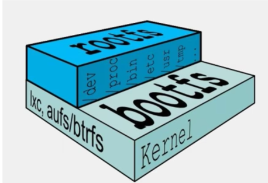

====================
Docker镜像
====================

分层的镜像
===================

在我们下载(删除)镜像的时候 好像是在一层一层下载（删除）:
::

    xiaoyan@xiaoyan Desktop % docker rmi -f redis
    Untagged: redis:latest
    Untagged: redis@sha256:db485f2e245b5b3329fdc7eff4eb00f913e09d8feb9ca720788059fdc2ed8339
    Deleted: sha256:7614ae9453d1d87e740a2056257a6de7135c84037c367e1fffa92ae922784631
    Deleted: sha256:49c70179bc923a7d48583d58e2b6c21bde1787edf42ed1f8de9e9b96e2e88e65
    Deleted: sha256:396e06df5d1120368a7a8a4fd1e5467cdc2dd4083660890df078c654596ddc1c
    Deleted: sha256:434d118df2e9edb51238f6ba46e9efdfa21be68e88f54787531aa39a720a0740
    Deleted: sha256:2047f09c412ff06f4e2ee8a25d105055e714d99000711e27a55072e640796294
    Deleted: sha256:13d71c9ccb39b206211dd1900d06aa1984b0f5ab8abaa628c70b3eb733303a65
    Deleted: sha256:2edcec3590a4ec7f40cf0743c15d78fb39d8326bc029073b41ef9727da6c851f
    xiaoyan@xiaoyan Desktop % docker pull redis
    Using default tag: latest
    latest: Pulling from library/redis
    a2abf6c4d29d: Pull complete
    c7a4e4382001: Pull complete
    4044b9ba67c9: Pull complete
    c8388a79482f: Pull complete
    413c8bb60be2: Pull complete
    1abfd3011519: Pull complete

UnionFS(联合文件系统)
==================================

| Union文件系统（UnionFS）是一种分层、轻量级并且高性能的文件系统，它支持对文件的修改作为一次提交来 一层层叠加
| 同时可以将不同的目录挂载到同一个虚拟文件系统下。Union文件系统是Docker镜像的基础
| 镜像通过分层来继承，基于基础镜像（没有父镜像），可以制作各种具体的应用镜像

特性：
    - 一次同时加载多个文件系统,但从外面看起来，只能看到一个文件系统，联合加载会把各层文件系统叠加起来
    - 这样最终的文件系统会包含所有底层的文件和目录

Docker镜像加载原理
================================

| Docker镜像实际上是由一层一层的文件系统组成的，这种层级的文件系统UnionFS
| bootfs（boot file system）主要包含BootLoader 和kernel, bootloader 主要是引导kernel
| Linux刚启动时会加载bootfs文件系统，在Docker镜像的最底层是引导文件系统bootfs
| 这一层与我们典型的 Unix/Linux 系统是一样的， 包含 boot加载器和内核
| 当boot加载完成后 整个内核就都在内存中了
| 此时内存的使用权 已由bootfs 转交给内核， 此时系统也会卸载 bootfs

| rootfs(root file system ), 在bootfs之上
| 包含的就是典型 Linux系统中/dev, /proc, /bin, /etc 等标准目录和文件
| rootfs就是各种不同的操作系统发行版，比如 ubuntu， centos等等

对于一个精简的OS， rootfs可以很小， 只需包括最基础的命令、工具和程序库就可以了
因为底层直接用Host的kernel，自己只需要提供rootfs就可以了
由此可见对于不同发行版的Linux,bootfs基本是一致的，rootfs会有差别,因此不同发行版可以公用bootfs

采用分层结构的原因
==========================

镜像分层最大的一个好处就是共享资源，方便复制迁移，就是为了复用

比如说有多个镜像都从相同的base镜像构建而来， 那么Docker Host 只需要在磁盘上保存一份base镜像
同时内存中也只需加载一份base镜像,就可以为所有容器服务。而且镜像的每一层都是可以被共享的

重点理解
=================

- Docker的镜像层都是只读的，容器层是可写的
- 当容器启动时，一个新的可写层被加载到镜像的顶部
- 这一层通常叫做'容器层'， '容器层'之下的都是镜像层

当容器启动时， 一个新的可写层被加载到镜像的顶部。 这一层通常被称作"容器层"， "容器层" 之下的都叫"镜像层"。
所有对容器的改动 - 无论添加，删除， 还是修改文件 都只会发生在容器层中， 只有容器层是可写的， 容器层下面的所有镜像都是只读的。

.. image:: ../../_static/Docker/img1.png
    :align: center

Docker Commit
==========================

docker commit 提交容器副本使之成为一个新的镜像

`docker commit -m="提交的描述信息" -a="作者" 容器ID 要创建的目标镜像名:[标签名]`

实例
--------------

默认的ubuntu没有vim 命令 创建一个拥有vim命令的ubuntu镜像

1. `docker run -it ubuntu /bin/bash` 实例化镜像并进入容器
2. `apt-get update && apt-get install -y vim` 下载vim命令
3. `docker commit -m 'add vim' -a 'xiaoyan' a0c29c013a99 test/ubuntu-vim:latest` 提交容器 生成新的镜像

小总结
===================

Docker 中的镜像分层， *支持通过拓展现有镜像， 创建新的镜像* 类似 与面向对象中的继承
新镜像是从 base镜像 一层一层叠加生成的。 每安装一个软件，就是在现有的基础上增加一层

.. image:: ../../_static/Docker/img2.png
    :align: center
