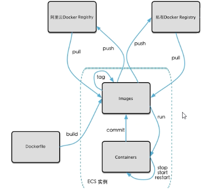

===============================
公开库、私有库
===============================

本地镜像发布流程
================================

将本地镜像推送到阿里云仓库
==================================

.. code-block:: shell

    xiaoyan@xiaoyan ~ % docker login --username=三三三要用云 registry.cn-chengdu.aliyuncs.com
    Password:
    Login Succeeded
    xiaoyan@xiaoyan ~ % docker tag [ImageId] registry.cn-chengdu.aliyuncs.com/xiaoyan_docker/test:[镜像版本号]
    xiaoyan@xiaoyan ~ % docker images
    REPOSITORY               TAG       IMAGE ID       CREATED          SIZE
    test/ubuntu-vim          latest    3100188ad0de   21 minutes ago   176MB
    xiaoyan@xiaoyan ~ % docker tag 3100188ad0de  registry.cn-chengdu.aliyuncs.com/xiaoyan_docker/test:latest
    xiaoyan@xiaoyan ~ % docker images
    REPOSITORY                                             TAG       IMAGE ID       CREATED          SIZE
    registry.cn-chengdu.aliyuncs.com/xiaoyan_docker/test   latest    3100188ad0de   22 minutes ago   176MB
    xiaoyan@xiaoyan ~ % docker push registry.cn-chengdu.aliyuncs.com/xiaoyan_docker/test:latest
    The push refers to repository [registry.cn-chengdu.aliyuncs.com/xiaoyan_docker/test]
    d6ab0f4e97d4: Pushed
    9f54eef41275: Pushed
    latest: digest: sha256:0ba9e241e4b29ce86527a2b5a4d548d60bcac976cd6fc9b7f5ec8cc86eba437f size: 741

将阿里云仓库镜像 下载到本地使用
========================================

.. code-block:: shell

    xiaoyan@xiaoyan ~ % docker images
    REPOSITORY               TAG       IMAGE ID       CREATED        SIZE

    xiaoyan@xiaoyan ~ % docker pull registry.cn-chengdu.aliyuncs.com/xiaoyan_docker/test

    xiaoyan@xiaoyan ~ % docker images
    REPOSITORY                                             TAG       IMAGE ID       CREATED          SIZE
    registry.cn-chengdu.aliyuncs.com/xiaoyan_docker/test   latest    3100188ad0de   29 minutes ago   176MB
    xiaoyan@xiaoyan ~ % docker run -it 3100188ad0de /bin/bash
    root@17498ebc90a2:/# vim
    root@17498ebc90a2:/#
    root@17498ebc90a2:/#
    root@17498ebc90a2:/# vim --version
    VIM - Vi IMproved 8.1 (2018 May 18, compiled Feb 01 2022 09:16:32)

Docker registry
=========================

1. 下载镜像registry
    1.1 `docker pull registry`
2. 运行私有库registry，相当于本地有个私有Docker hub
    2.1 `docker run -dp 5000:5000 -v /Users/xiaoyan/Desktop/test:/tmp/registry --privileged=true registry`
    2.2 默认情况， 仓库被创建在/var/lib/registry目录下， 建议自行用容器卷映射， 方便宿主机联调
#. 创建一个新的镜像 在ubuntu的基础上加一个ifconfig命令
    #.1 `docker run -it ubuntu /bin/bash`
    #.2 `apt-get update && apt-get install -y net-tools`
    #.3 `docker commit -m 'add ifconfig' -a 'xiaoyan' 9907a8b6f13b test/ubuntu-ifconfig:latest`
#. curl 验证 私服库上有什么镜像
    #.1 `curl -XGET http://192.168.10.123:5000/v2/_catalog  --->>> {"repositories":[]}`
#. 将新镜像 修改为符合私服规范的Tag
    #.1 `docker tag Host:Port/Repository:Tag`
    #.2 `docker tag 15177afef457 192.168.10.123:5000/ubuntu-ifconfig:1.0`
#. 修改配置文件 使之支持http
    #.1 vim /etc/docker/daemon.json:
        ::

              "registry-mirrors": [
                "https://6txzqw99.mirror.aliyuncs.com"
              ],
              "insecure-registries": ["192.168.10.123:5000"]  # 新增
              # docker默认不支持http方式推送镜像， 通过配置来取消这个限制

#. push 推送到私服库
    #.1 `docker push 192.168.10.123:5000/ubuntu-ifconfig:1.0`
#. curl 验证 推送是否成功
    #.1 `curl -XGET http://192.168.10.123:5000/v2/_catalog  --->>>  {"repositories":["ubuntu-ifconfig"]}`
#. pull 到本地镜像验证
    #.1 `docker pull 192.168.10.123:5000/ubuntu-ifconfig:1.0`
    #.2 `docker run -it 15177afef457 /bin/bash`
    #.3 `ifconfig`

