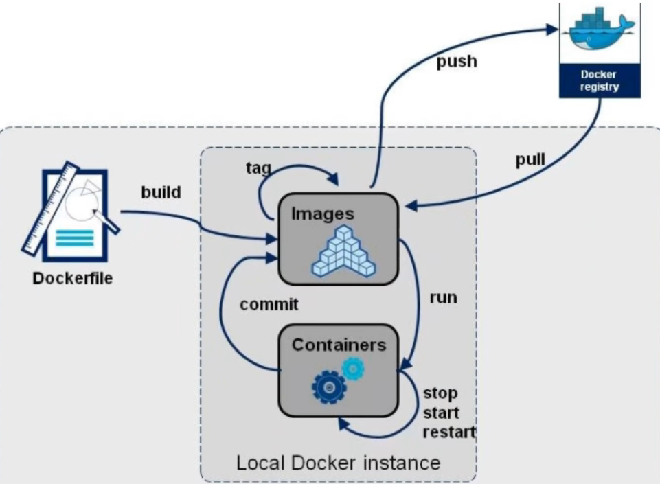
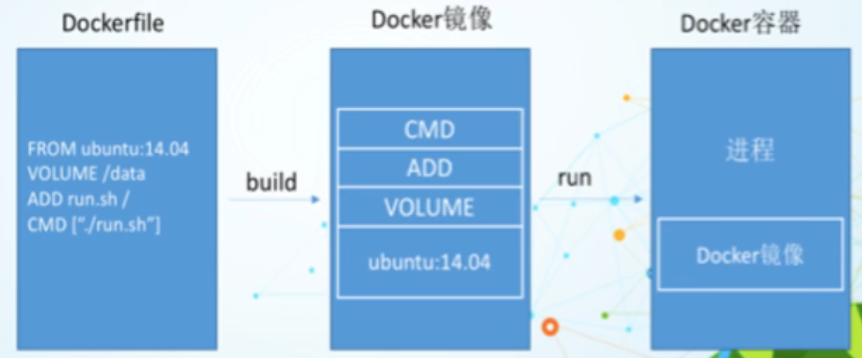

===========================
Dockerfile
===========================

什么是Dockerfile
======================

Dockerfile 是用来构建Docker镜像的文本文件 是由一条条构建镜像所需的指令和参数构成的脚本

官方地址: 访问 `Dockerfile <https://docs.docker.com/engine/reference/builder>`_ ,查看更多

构建三步骤
------------------------

1. 编写Dockerfile文件
#. `docker build` 命令构建镜像
#. `docker run` 根据镜像运行容器实例

DockerFile构建过程
============================

Dockerfile内容基础知识
-------------------------------

1. 每条保留字指令都 必须为大写字母 且后面要跟随至少一个参数
#. 指令按照从上到下， 顺序执行
#. #表示注释
#. 每条指令都会创建一个新的镜像层并对镜像进行提交

Docker执行Dockerfile的大致流程
------------------------------------

1. docker从基础镜像运行一个容器
#. 执行一条指令并对容器作出修改
#. 执行类似docker commit的操作提交一个新的镜像层
#. docker再基于刚提交的镜像运行一个新容器
#. 执行dockerfile中的下一条指令直到所有指令都执行完成

小总结
-------------------

从应用软件的角度来看， Dockerfile、Docker镜像与Docker容器分别代表软件的三个不同阶段

- Dockerfile是软件的原材料
- Docker 镜像是软件的交付品
- Docker容器则是 可以认为是软件镜像的运行态， 也即依照镜像运行的容器实例

Dockerfile面向开发， Docker镜像成为交付标准， Docker容器则涉及部署与运维， 三者缺一不可， 合理充当Docker体系的基石

DockerFile 常用保留字指令
===================================

- FROM
    - 基础镜像， 当前新镜像是基于那个镜像的， 指定一个已经存在的镜像作为模板， 第一条必须是from
- MAINTAINER
    - 镜像维护者的邮箱和姓名
- RUN
    - 容器构建时需要允许的命令
    - 两种格式
        - shell 格式
            - RUN <命令行命令> # <命令行命令> 等同于在终端操作的shell命令
        - exec 格式
            - RUN ["./test.py"，"arg1"， "arg2"，...] # 等价于 RUN ./test.py arg1 arg2
    - RUN是在docker build时运行
- EXPOSE
    - 当前容器对外暴露的端口
- WORKDIR
    - 指定在创建容器后， 终端默认登录进入后的工作目录， 一个落脚点
- USER
    - 指定该镜像以什么样的用户去执行， 如果都不指定， 默认是root
- ENV
    - 用来在构建镜像过程中设置环境变量
        - ENV MY_PATH /usr/mytest 这个环境变量可以在后续的任何RUN指令中使用  也可以在其他指令中直接使用 比如 WORKDIR $MY_PATH
- ADD
    - 将宿主机目录下的文件拷贝进镜像且会自动处理url和解压tar压缩包
- COPY
    - 类似ADD ， 拷贝文件和目录到镜像汇总。 将从构建上下文目录种<源路径>的文件/目录复制到新的一层镜像内的<目标路径>位置
        - COPY src dest
        - COPY ["src", "dest"]
        - COPY <src源路径>: 源文件或源目录
        - COPY <dest目标路径>: 容器内的指定路径， 该路径不用事先创建好
- VOLUME
    - 容器数据卷， 用于数据保存和持久化工作
- CMD
    - 指定容器启动后要干的事情
        - shell格式： CMD <命令>
        - exec格式： CMD ["可执行文件"，"参数1"， "参数2"]
        - 参数列表格式： CMD["参数1"， "参数2"] 在指定了 ENTRYPOINT指令后，用CMD指定具体的参数
    - 他和RUN命令的区别是
        - CMD 在 docker run时运行
        - RUN 在 docker build时运行
    - 注意
        - Dockerfile中可以有多个CMD指令， 但只有最后一个生效， CMD会被docker run 之后的参数替换
- ENTRYPOINT
    - 用来指定一个容器启动时要运行的命令
    - 类似于CMD指令， 但是ENTRYPOINT不会被docker run 后面的命令覆盖， 而且这些命令行参数会被当做参数 送给ENTRYPOINT指令指定的程序
    - 命令格式: ENTRYPOINT ["executeable", "param1", "param2"]:
    ::

        ENTRYPOINT 可以和CMD 一起用， 一般是变参才会使用CMD， 这里的CMD等于是在给ENTRYPOINT传参
        当指定了ENTRYPOINT后， CMD的含义就发生了变化， 不在是直接运行其命令而是将CMD的内容作为参数传递个ENTRYPOINT指令，
        他们两个组合会变参 ENTRYPOINT "<CMD>"
        例如：
        FROM nginx
        ENTRYPOINT ["nginx", "-c"]  # 定参
        CMD ["/etc/nginx/nginx.conf"]  # 变参

