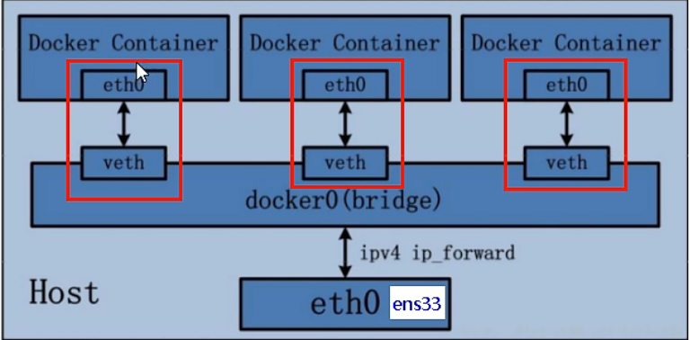

========================
docker_network
========================

什么是docker网络
=======================

在docker服务启动后，会生成一个名字为docker0 的虚拟网桥， 用来进行网络连接
docker服务启动后， 网络情况查看：`docker network ls` :
::

    # 默认创建的三大模式
    xiaoyan@xiaoyan ~ % docker network ls
    NETWORK ID     NAME      DRIVER    SCOPE
    f8c2f0199f23   bridge    bridge    local
    a23445ad3155   host      host      local
    af16d7693892   none      null      local

常用命令
=====================

::

    Usage:  docker network COMMAND

    Manage networks

    Commands:
      connect     Connect a container to a network  # 连接网络
      create      Create a network  # 创建网络
      disconnect  Disconnect a container from a network  # 断开网络
      inspect     Display detailed information on one or more networks # 查看网络源数据
      ls          List networks  #  查看所有网络
      prune       Remove all unused networks  # 清除 虚悬网络
      rm          Remove one or more networks  # 删除 指定网络

能干嘛
==================

容器间的互联和通信 以及 端口映射
容器IP变动时候 可以通过服务名 直接网络通信 而不受影响

网络模式
===================

总体介绍
------------------

bridge
^^^^^^^^^^^^^^^^^

`--network bridge` 指定 默认使用docker0
为每一个容器分配、设置IP等， 并将容器连接到一个docker0的虚拟网签， 默认为该模式

host
^^^^^^^^^^^^^^^^^^

`--network host` 指定
容器将不会虚拟出自己的网卡， 配置自己的IP等， 而是使用宿主机的IP和端口。

none
^^^^^^^^^^^^^^^^^

`--network none` 指定
容器有独立的Network namespace， 但并没有对其镜像任何网络设置， 如分配 veth pair 和网桥连接， IP等

container
^^^^^^^^^^^^^^^^^^^

`--network container:NAME或容器ID` 指定
新创建的容器不会创建自己的网卡和配置自己的IP，而是和一个指定的容器共享IP，端口范围

容器实例内默认网络IP生产规则
=====================================

docker容器内部的ip是有可能会发生变化的

::

    xiaoyan@xiaoyan ~ % docker run -it --name u2 ubuntu
    xiaoyan@xiaoyan ~ % docker run -it --name u3 ubuntu

    xiaoyan@xiaoyan ~ % docker ps
    CONTAINER ID   IMAGE     COMMAND   CREATED          STATUS          PORTS     NAMES
    b26ac197e3ae   ubuntu    "bash"    10 seconds ago   Up 9 seconds              u3
    e500d386789d   ubuntu    "bash"    17 seconds ago   Up 16 seconds             u2

    xiaoyan@xiaoyan ~ % docker inspect u2| tail -n 20
                "Networks": {
                    "bridge": {
                        "IPAMConfig": null,
                        "Links": null,
                        "Aliases": null,
                        "NetworkID": "f8c2f0199f23b8cedee805e967b8ba03993819b6900b6993fe23910b722d8bd3",
                        "EndpointID": "ba9fd8666b6ab1c0920f912924bddc393a7c3e6c39dccb060cf38df764af98f2",
                        "Gateway": "172.17.0.1",
                        "IPAddress": "172.17.0.2",  # IP 地址
                        "IPPrefixLen": 16,
                        "IPv6Gateway": "",
                        "GlobalIPv6Address": "",
                        "GlobalIPv6PrefixLen": 0,
                        "MacAddress": "02:42:ac:11:00:02",
                        "DriverOpts": null
                    }
                }
            }
        }
    ]
    xiaoyan@xiaoyan ~ % docker inspect u3| tail -n 20
                "Networks": {
                    "bridge": {
                        "IPAMConfig": null,
                        "Links": null,
                        "Aliases": null,
                        "NetworkID": "f8c2f0199f23b8cedee805e967b8ba03993819b6900b6993fe23910b722d8bd3",
                        "EndpointID": "e2787ba14bbcff89e0d0cc42e5afdd3b6212d36f0c9807743f32fa5f4f573827",
                        "Gateway": "172.17.0.1",
                        "IPAddress": "172.17.0.3",  # IP 地址
                        "IPPrefixLen": 16,
                        "IPv6Gateway": "",
                        "GlobalIPv6Address": "",
                        "GlobalIPv6PrefixLen": 0,
                        "MacAddress": "02:42:ac:11:00:03",
                        "DriverOpts": null
                    }
                }
            }
        }
    ]
    此时  u2 的 ip地址是 172.17.0.2
    此时  u3 的 ip地址是 172.17.0.3

    xiaoyan@xiaoyan ~ % docker rm -f u3
    xiaoyan@xiaoyan ~ % docker run -it --name u4 ubuntu
    xiaoyan@xiaoyan ~ % docker inspect u4
                    "Networks": {
                    "bridge": {
                        "IPAMConfig": null,
                        "Links": null,
                        "Aliases": null,
                        "NetworkID": "f8c2f0199f23b8cedee805e967b8ba03993819b6900b6993fe23910b722d8bd3",
                        "EndpointID": "78c68be783841b63bc8f74aae90a428516b4e8a5572aca164c7c51612075160a",
                        "Gateway": "172.17.0.1",
                        "IPAddress": "172.17.0.3",
                        "IPPrefixLen": 16,
                        "IPv6Gateway": "",
                        "GlobalIPv6Address": "",
                        "GlobalIPv6PrefixLen": 0,
                        "MacAddress": "02:42:ac:11:00:03",
                        "DriverOpts": null
                    }
                }
            }
        }
    ]
    此时 u4 的ip变为了 172.17.0.3

案例
==================

bridge
-----------------

是什么
^^^^^^^^^^^^^^^^

Docker 服务会默认创建一个docker0网桥（其上有一个docker0内部接口）， 该网桥的名称为docker0，
他在内核层连通了其他的物理或虚拟网卡，这就将所有容器和本地主机都放到了同一个物理网络。
Docker默认指定了docker0接口的IP地址和子网掩码， 让主机和容器之间可以通过网桥相互通信。

Docker使用Linux桥接， 在宿主机虚拟一个Docker容器网桥（docker0）， Docker启动一个容器会根据
Docker网桥的网段分配给容器一个IP地址，称为Container-IP， 同时Docker网桥是每个容器默认网关，
因为在同一宿主机内的容器都接入同一个网桥， 这样容器之间就能通过容器的Container-IP直接通信

docker run的时候， 没有指定network的默认使用网桥模式就是bridge， 使用的就是docker0，在宿主机ifconfig
就可以看到docker0和自己create的network， eth0，eth1，eth2表示网卡0，网卡1，网卡2
lo代表localhost回环地址 127.0.0.1， inet addr 用来表示网卡的IP地址

网桥docker0创建一对对等虚拟设备接口一个叫veth，另一个叫eth0，成对匹配

整个宿主机的网桥模式都是docker0， 类似一个交换机有一堆接口， 每个接口叫veth，
在本地主机和容器内分别创建一个虚拟接口，并让他们彼此联通（这样一对接口叫 veth pair)

每个容器实例内部也有一块网卡， 每个接口叫eth0

docker0上面的每个veth匹配某个容器实例内部的eth0， 两两配对， 一一匹配

验证
^^^^^^^^^^^^^^

::

    # 启动两个容器
    [root@sanye ~]# docker run -dp 5001:5000 --name flask1 02d38c5c4ab9
    [root@sanye ~]# docker run -dp 5002:5000 --name flask2 02d38c5c4ab9

    # 宿主机上 新增连个 veth 7 和 9
    [root@sanye ~]# ip addr | tail -n 8
    7: veth2462c64@if6: <BROADCAST,MULTICAST,UP,LOWER_UP> mtu 1500 qdisc noqueue master docker0 state UP group default
        link/ether 46:c8:fb:13:22:f2 brd ff:ff:ff:ff:ff:ff link-netnsid 1
        inet6 fe80::44c8:fbff:fe13:22f2/64 scope link
           valid_lft forever preferred_lft forever
    9: veth67ac773@if8: <BROADCAST,MULTICAST,UP,LOWER_UP> mtu 1500 qdisc noqueue master docker0 state UP group default
        link/ether de:33:0f:6b:d7:d1 brd ff:ff:ff:ff:ff:ff link-netnsid 2
        inet6 fe80::dc33:fff:fe6b:d7d1/64 scope link
           valid_lft forever preferred_lft forever

    # 进入容器flask1
    [root@sanye ~]# docker exec -it flask1 bash
    root@9b7ca90ebc1b:/home/docker# ip addr
    6: eth0@if7 ....................

    # 进入容器flask2
    [root@sanye ~]# docker exec -it flask2 bash
    root@9b7ca90ebc1b:/home/docker# ip addr
    8: eth0@if9 ....................

    # 在宿主机中 新增 veth  容器中新增eth0  两两对应
