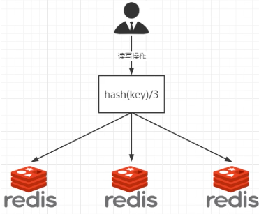
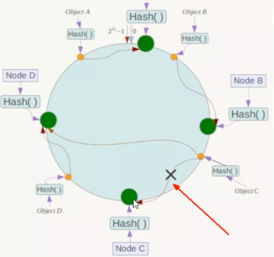
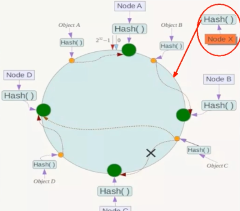
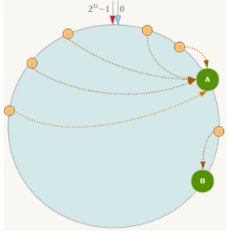

====================================
常用软件集群安装
====================================

mongo复制集
========================

先启动三个mongo容器:
::

     docker run -dp 27017:27017 -v /Users/xiaoyan/Desktop/mongo/data/db2:/data/db/ -v /Users/xiaoyan/Desktop/mongo/log/log2:/log/ --privileged=true mongo --replSet demo --dbpath /data/db --logpath /log/mongod.log
     docker run -dp 27018:27017 -v /Users/xiaoyan/Desktop/mongo/data/db2:/data/db/ -v /Users/xiaoyan/Desktop/mongo/log/log2:/log/ --privileged=true mongo --replSet demo --dbpath /data/db --logpath /log/mongod.log
     docker run -dp 27019:27017 -v /Users/xiaoyan/Desktop/mongo/data/db3:/data/db/ -v /Users/xiaoyan/Desktop/mongo/log/log3:/log/ --privileged=true mongo --replSet demo --dbpath /data/db --logpath /log/mongod.log

    如果要创建复制集的话  一定要加上 --replSet 复制名称 参数
    --shardsvr 为分片参数

进入一个mongo容器 进行复制集初始化:
::

    rs.initiate({
        _id:"demo",
        members:[
            {_id:0,host:"192.168.10.123:27017"},
            {_id:1,host:"192.168.10.123:27018"},
            {_id:2,host:"192.168.10.123:27019"}
            ]
        })
    # 注意  这里 的host 必须为 宿主机的 私网或者公网 ip  不能用127.0.0.1 或者 localhost

Redis
================

一提到数据量大，第一时间联想到分布式

分布式存储之哈希取余算法
------------------------------

优点
^^^^^^^^^^^^^^^

简单粗暴，直接有效，只需要预估好数据规划好节点， 例如 3台， 8台，就能保证一段时间的数据支撑。
使用Hash算法让固定的一部分请求落到同一台服务器上， 这样每台服务器固定处理一部分请求，
起到负载均衡 + 分而治之的作用

缺点
^^^^^^^^^^^^^^^^^

原来规划好的节点，进行扩容或者缩容就比较麻烦了， 不管扩缩，每次数据变动导致节点有变动，
映射关系需要重新计算， 在服务器个数固定不变时没有问题， 如果需要弹性扩容或者故障停机的情况下，
原来的取模公式就会发生变化， Hash(key)/3 变为Hash(key)/x？
此时地址经过某个redis机器宕机了， 由于台数变化， 会导致hash取余全部数据从新洗牌

一致性哈希算法
----------------------

当服务器个数发生变动时，尽量减少影响客户端到服务器的映射关系

三大步骤
^^^^^^^^^^^^^^^^^^^

1. 算法构建一致性哈希环
    1.1 一致性哈希算法 必然有个hash函数并并按照算法产生hash值， 这个算法的所有可能哈希值会构成一个全量集，
    这个集合可以成为一个hash空间[0,2^32-1], 这是一个线性空间，但是在算法中， 我们通过适当的逻辑
    将它收尾相连（0=2^32)， 这样让它逻辑上形成了一个环形空间。

    它也按照使用取余的方式， 之前取余是对节点（服务器）数量进行取余
    而一致性Hash算法是对2^32去余， 简单来说， 一致性Hash算法将整个哈希值空间组织成了一个虚拟的圆环

    .. image:: ../../_static/Docker/img_5.png
        :align: center

2. 服务器IP节点映射
    2.1 将集群汇中各个OP节点映射到环上的某一个位置
    将各个服务器使用Hash进行一个哈希， 具体可以选择服务器的IP或者主机名最为关键字进行哈希，
    这样每台机器就能确定其在哈希环上的位置

    .. image:: ../../_static/Docker/img_6.png
        :align: center

3. key落到服务器的落键规则
    3.1 当我们需要存储一个kv键值对时， 首先计算key的hash值，hash（key），将这个key使用想的函数Hash计算
    算出哈希值并确定此数据在环上的位置， 从此位置沿环顺时针 "行走"， 第一台遇到的服务器就是其因该定位到的服务器
    并将该键值对存储在该节点上

    .. image:: ../../_static/Docker/img_7.png
        :align: center

优点
^^^^^^^^^^^^^^

一致性哈希算法的容错性：
::

    假设其中一台宕机， 可以看到此时其他服务器不会收到影响， 只有宕机对象的数据被重新定位到顺时针的下一台服务器
    一般的， 在一致性Hash算法中，如果一台服务器不可用，则受到影响的数据仅仅是次服务器到其环空间中前一台服务器之间的数据
    其他不会受到影响。

一致性哈希算法的扩展性：
::

    数据量增加了， 需要增加一台服务器， 那受到影响的服务器 只有 新服务器的前后各一台之间的数据
    其他的不会受到影响， 不会导致hash取余重新洗牌

缺点
^^^^^^^^^^^^^

一致性哈希算法的数据倾斜问题:
::

    一致性Hash算法在服务节点太少时， 容易因为节点分布不均匀而造成数据倾斜
    （被缓存的大部分集中缓存在某一台服务器上）问题

总结
^^^^^^^^^^^^^^

为了在节点数目发生变化时尽可能少的迁移数据

将所有的存储节点排列在首尾相连的Hash环上， 每个key在计算Hash后顺时针找到临近的存储节点存放
而当有节点加入或退出时 仅影响该节点在Hash环上顺时针相邻的后续节点

优点：
    加入和删除节点只影响哈希环汇中顺时针方向的相邻节点， 对其他节点无影响

缺点：
    数据的分布和节点的位置有关， 因为这些节点不是均匀的分布在哈希环上，所有数据在进行存储时到不到均匀分布的效果

哈希槽算法
---------------------
