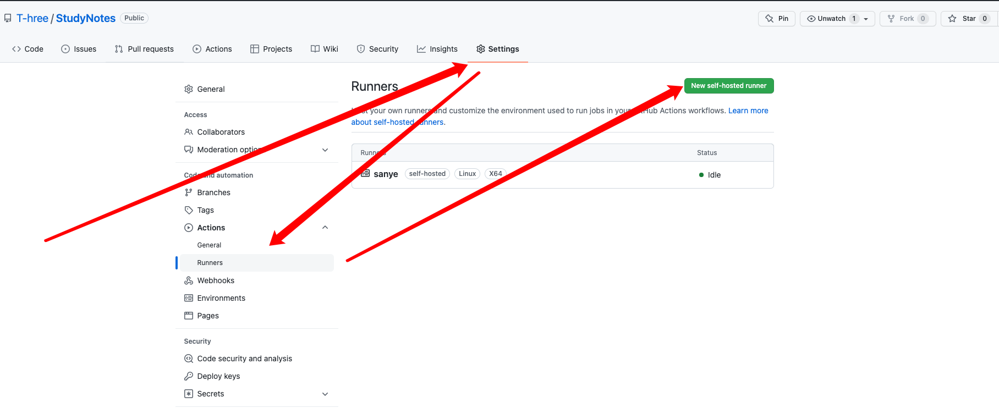

============================
CI_CD自动部署
============================

github官方文档：`点击此处跳转 <https://docs.github.com/cn/actions/quickstart>`_

在服务器上部署runner服务
=====================================



选择好对应的服务器版本后：
::
    先下载
    # Create a folder
    $ mkdir actions-runner && cd actions-runner# Download the latest runner package
    $ curl -o actions-runner-linux-x64-2.289.2.tar.gz -L https://github.com/actions/runner/releases/download/v2.289.2/actions-runner-linux-x64-2.289.2.tar.gz# Optional: Validate the hash
    $ echo "7ba89bb75397896a76e98197633c087a9499d4c1db7603f21910e135b0d0a238  actions-runner-linux-x64-2.289.2.tar.gz" | shasum -a 256 -c# Extract the installer
    $ tar xzf ./actions-runner-linux-x64-2.289.2.tar.gz
    下载好解压后运行
    # Create the runner and start the configuration experience
    $ ./config.sh --url https://github.com/T-hree/StudyNotes --token XXXXXX(runner创建页面上的token)     # Last step, run it!
    $ ./run.sh
    此时如果你是用root用户执行上面两行代码的话 会无法执行 返回提示信息：
    Must not run with sudo   # 一定不能使用管理员权限运行  github为了保证你服务器的安全 建议创建一个用户来执行
    如果 想直接 通过 root 权限执行的话
    vim ./config.sh
    ```
    if [ $user_id -eq 0 -a -z "$RUNNER_ALLOW_RUNASROOT" ]; then
    echo "Must not run with sudo"
    exit 1
    fi
    ```
    删除这几行代码
    ./run.sh 同理

    执行 ./config.sh 是回问你4个问题
    # runner组
    Enter the name of the runner group to add this runner to: [press Enter for Default]
    # runner 的名字
    Enter the name of runner: [press Enter for sanye]
    # 在你的工作流中  runs-on 时 可以写的 参数
    This runner will have the following labels: 'self-hosted', 'Linux', 'X64'
    Enter any additional labels (ex. label-1,label-2): [press Enter to skip]

    √ Runner successfully added
    √ Runner connection is good

    # Runner settings
    # 你的项目clone下来保存的位置
    Enter name of work folder: [press Enter for _work] /home

    然后执行
    ./run.sh   # 即可  监听github 工作流
    √ Connected to GitHub

    Current runner version: '2.289.2'
    2022-04-15 07:25:26Z: Listening for Jobs


编写CI/CD YAML文件
============================

在你的项目目录中 创建  project_dir/.github/workflows/cicd_name.yml文件

工作流程的语法具体参考github官方： `工作流程语法 <https://docs.github.com/cn/actions/using-workflows/workflow-syntax-for-github-actions>`_

sphinx项目简单实例：
::

    name: CI  # 工作流名称

    on: push   # 在什么情况下触发

    jobs:   # 任务  可以多个任务
      Test:   # 任务名称  自定义
        runs-on: self-hosted  # 运行在哪里
        steps:  # 操作步骤
          - name: Check out repository code  # 步骤的名称
            uses: actions/checkout@v3   # 使用现有的 工作流步骤 checkout 是简化你clone cd project_dir 等一些列步骤
          - run: make html  # 执行的shell命令