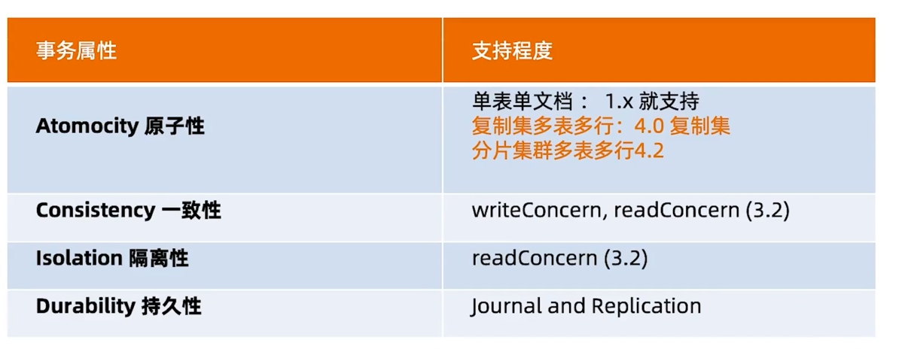
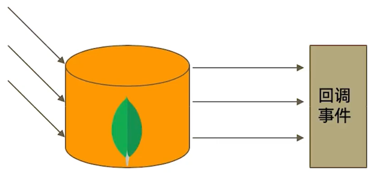
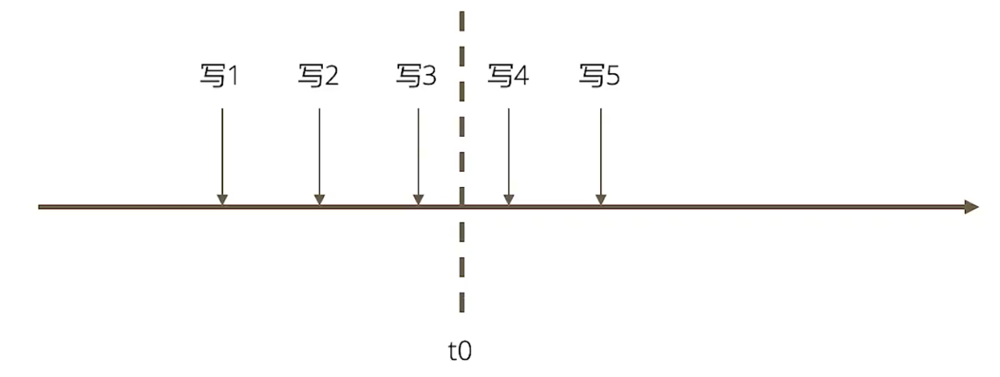
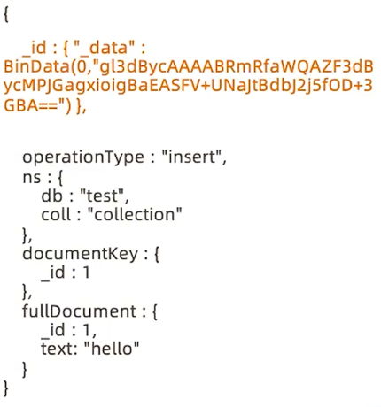

=========================
Change Stream
=========================

什么是 Change Stream
=========================

Change Stream 是MongoDB 用于实现变更追踪的解决方案， 类似于关系数据库的触发器，但原理不完全相同：

Change Stream 的实现原理
===============================

Change Stream 是基于oplog 实现的。 他在oplog上开启一个tailablecursor来追踪所有复制集上的变更操作，
最终调用应用中定义的回调函数。

被追踪的变更事件主要包括：

- insert/update/delete: 插入、更新、删除
- drop: 集合被删除
- rename: 集合被重命名
- dropDatabase: 数据库被删除
- invalidate: drop/rename/dropDatabase 导致invalidate被触发， 并关闭 change stream

Change Stream 与 可重复读
=============================
change stream 只推送已经在大多数节点上提交的 变更操作。 即 '可重复读' 的变更。
这个验证是通过{readConcern:'majority'}实现的。因此：

- 未开启majority readConcern的集群无法使用 Change Stream
- 当集群无法满足{w:'majority'}时， 不会触发 Change Stream （例如PSA架构中的S因故障宕机)

Change Stream 变更过滤
==============================
如果只对某些类型的变更事件感兴趣， 可以使用聚合管道的过滤步骤过滤事件。
例如:
::

    var cs = db.collection.watch([{
        $match:{
            operationType:{
                $in:['insert', 'delete']
            }
        }
    }])

Change Stream 示例
============================

*注意*：如果要开启 Change Stream的话 需要在配置文件中加上 `enableMajorityReadConcern:true`

::

    # 开启 Change Stream 第一个参数是 过滤条件， 第二个参数是 多少时间内没有 追踪到指定的操作就会停止 单位毫秒
    rs0:PRIMARY> db.test.watch([],{maxAwaitTimeMS:30000})

    # 当有操作被捕捉时     db.collection.update({text:'hello'}，{$set:{}})
    { "_id" : { "_data" : "826257D654000000012B022C0100296E5A100400CC9D4B355B47C6A87D5282327EB06E46645F696400646257D5FDAFBCCDC0BD800B9F0004" }, "operationType" : "update", "clusterTime" : Timestamp(1649923668, 1), "ns" : { "db" : "test", "coll" : "test" }, "documentKey" : { "_id" : ObjectId("6257d5fdafbccdc0bd800b9f") }, "updateDescription" : { "updatedFields" : { "x" : 1232 }, "removedFields" : [ ], "truncatedArrays" : [ ] } }

    # 当有操作被捕捉时     db.collection.insert({text:'hello'})
    { "_id" : { "_data" : "826257D667000000012B022C0100296E5A100400CC9D4B355B47C6A87D5282327EB06E46645F696400646257D667AFBCCDC0BD800BA00004" }, "operationType" : "insert", "clusterTime" : Timestamp(1649923687, 1), "fullDocument" : { "_id" : ObjectId("6257d667afbccdc0bd800ba0"), "x" : 2 }, "ns" : { "db" : "test", "coll" : "test" }, "documentKey" : { "_id" : ObjectId("6257d667afbccdc0bd800ba0") } }

Change Stream 故障恢复
==========================

假设在一系列写入操作的过程中， 订阅 Change Stream 的应用在接收到 '写3' 之后于 t0 时刻崩溃， 重启后后续的变更怎么办

| 想要从上次终端的地方继续获得变更流，只需要保留上次变更通知中的_id即可
| 如图所示  是一次 Change Stream 回调所返回的数据。 每条这样的数据都带有一个 _id , 这个_id 可以用于断点回复
| 例如 : var cs = db.collection.watch([], {resumeAfter:<_id>}) 即可从上一条通知中断出继续获取后续的变更通知

Change Stream 使用场景
============================

- 跨集群的变更复制 ----  在源集群中订阅 Change Stream ， 一旦得到任何变更立刻写入 目标集群
- 微服务联动 ---- 当一个微服务变更数据库时， 其他微服务得到通知并作出相应的变更
- 其他任何需要系统联动的场景。

注意事项
======================

- Change Stream 依赖于oplog ， 因此中断时间不可超过 oplog  回收的最大时间窗
- 在执行 update 操作时， 如果只更新了部分数据， 那么 Change Stream 通知的也是增量部分
- 同理， 删除数据时  通知的仅是删除数据的_id