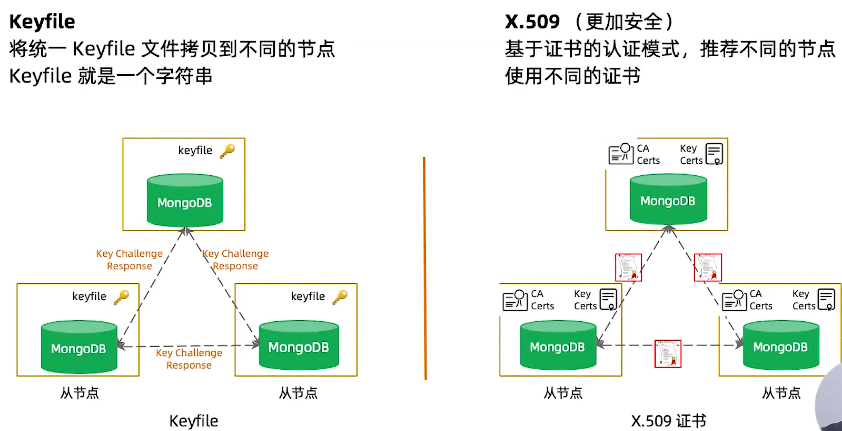
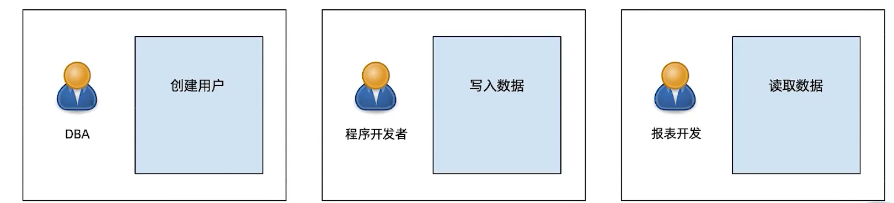
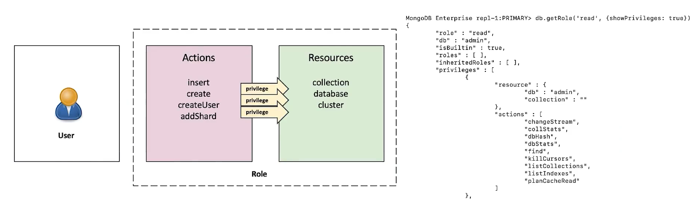
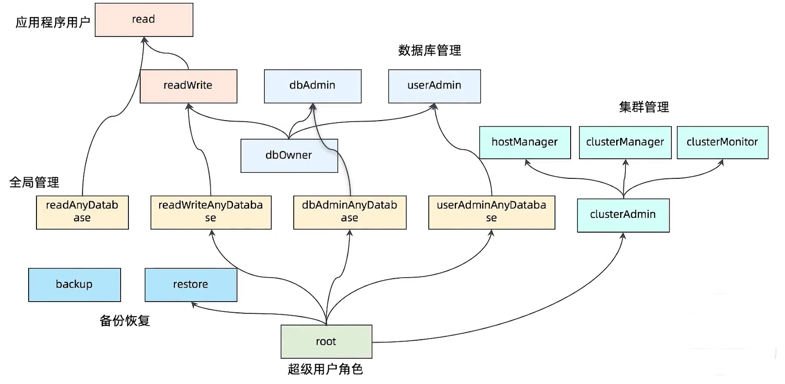
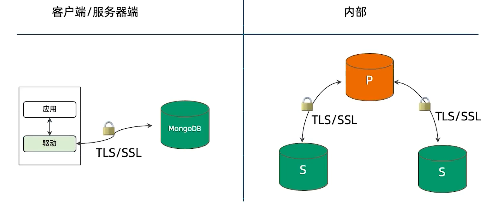
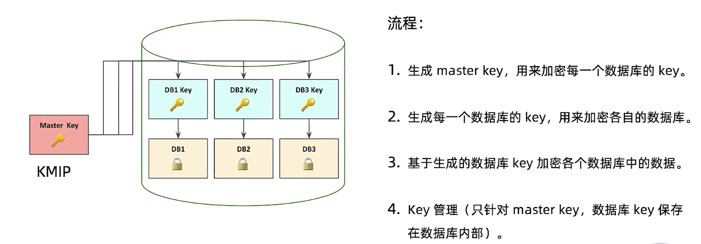
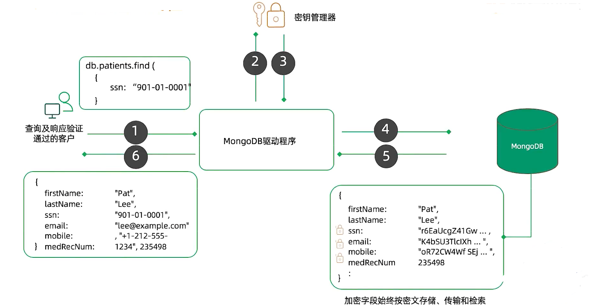

========================
MongoDB安全架构
========================

- AUTHENTICATION 认证
    - 客户端/服务端认证
        - SCRAM-SHA-1/256
        - X.509
        - LDAP
        - Kerberos
    - 内部集群认证
        - SCRAM-SHA-1/256
        - X.509
- AUTHORIZATION  鉴权
    - 基于用户角色进行权限控制
    - 基于不同数据库操作行为和不同目标作用域设定角色
    - 出来系统默认预设的角色， 用户还可以按照业务需求定制特定的角色
- AUDITING       审计
    - 对DDL 和 DML 操作进行审计
    - 对数据库认证授权等操作进行审计
    - 对复制集及分片等集群进行审计
    - 可以对不同层面的操作设定不同的过滤策略
- ENCRYPTION     加密
    - 基于 TLS/SSL 加密 MongoDB 驱动和 MongoDB 数据库之间的通信传输
    - 基于 TLS/SSL 加密 MongoDB 数据库内部节点之间的通信传输
    - 应用层加密特定字段， 基于KMIP、X.509 加密存储文件

MongoDB用户认证方式
===============================

- 1.用户名加密码
    - 默认认证方式
    - SCRAM-SHA-1 哈希算法
    - 用户信息存于MongoDB本地数据库
- 2.证书认证
    - X.509 标准
    - 服务端需要提供证书文件启动
    - 客户端需要证书文件连接服务端
    - 证书有外部或内部CA颁发
- 3.LDAP外部认证
    - 连接到外部LDAP服务器
        - 企业版功能
- Kerberos外部认证
    - 连接到外部Kerberos服务器
        - 企业版功能

MongoDB集群节点认证
===============================

MongoDB鉴权
========================

基于角色的权限机制
-----------------------

- MongoDB 授权基于角色的权限控制， 不同的权限的用户对数据库的操作不同
- 例如DBA可以创建用户， 应用开发者可以插入数据， 报表开发者 可以读取数据

角色的组成
-----------------------

MongoDB 内置角色及权限继承关系
-----------------------------------------

自定义角色
----------------------

MongoDB 默认没有设置用户名密码，需要我们自己设置。简单来说首先设置一个管理所有用户角色的用户admin，然后根据需要为此用户添加其他角色即可。

::

    # 创建角色
    db.createRole({
        role: "sampleRole",  # 角色名称
        privileges:[{   # 权限
            resource:{db:'sampledb', collection:'sample'},  # 对那些数据库 那些表有权限
            actions:['update']  # 具体的权限 有那些
            }],
        roles:[{  # 继承已有的权限角色
            role:'read',  # 继承权限的名称
            db:'sample'   # 哪一个库的权限角色
            }]  # 继承sample库中 read 角色的所有权限
        })
    # 创建用户
    db.createUser({
            user:'sampleUser',
            pwd:'password',
            roles:[{
                role:'sampleRole',  # 用户的角色
                db:'admin'   # 用户数据放在哪里
            }]
        })

传输加密
=================

| MongoDb支持TLS/SSL 来加密 MongoDB的所有网络传输 （客户端应用和服务器端之间，内部复制集之间）。
| TLS/SSL 确保MongoDB 网络传输仅可由允许的客户端读取

落盘加密
--------------

字段级加密
-----------------

- 单独文档字段通过自身密钥加密
- 数据库只看见密文
- 优势
    - 便捷： 自动及透明
    - 任务分开： 简化基于服务的系统步骤， 因为没有服务工程师能够看到纯文本
    - 合规： 监管"被遗忘权"
    - 快速： 最小性能代价

字段级加密流程
^^^^^^^^^^^^^^^^^^^^

审计
=============

- 数据库等记录型系统通常使用审计监控数据库相关的一些活动，以及对一些可疑的操作进行调查
- 记录格式： Json
- 记录方式： 本地文件 或 syslog
- 记录内容：
    - Schema change (DDL)
    - CRUD (DML)
    - 用户认证

审计配置参数举例
------------------------

* 默认审计是没有打开的 *

- 审计日志记录到syslog
    - `--auditDestination syslog`
- 审计日志记录写到指定文件
    - `--auditDestination file --auditFormat JSON --auditPath /path/to/auditLog.json`
- 对删表和创建表动作进行审计日志记录
    - `--auditDestination file --auditFormat JSON --auditPath auditLog.json --auditFilter '{atype:{$in:["createCollection","dropCollection"]}}'`

