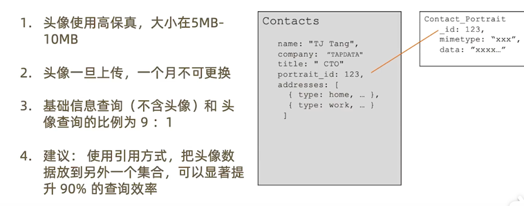

============================
MongoDB文档模型设计三部曲
============================

基础建模
==============

1. 根据概念模型或者业务需求推导出逻辑模型 - 找到对象
2. 列出实体之间的关系(及基数) - 明确关系
#. 套用逻辑设计原则来决定内嵌方式 - 进行建模
#. 完成基础模型构建

一个联系人管理应用的例子
-------------------------

关系建模 1对1
^^^^^^^^^^^^^^^

关系建模 1对N
^^^^^^^^^^^^^^^

关系建模 N对N
^^^^^^^^^^^^^^^

工况细化
===============

联系人管理应用的分组需求
-------------------------

解决方案： Group使用单独集合
^^^^^^^^^^^^^^^^^^^^^^^^^^^^^^

引用模式下的关联查询
^^^^^^^^^^^^^^^^^^^^^^^^^^^^^^

.. image:: ../_static/mongodb/img/img_46.png
    :align: center

联系人的头像：引用模式
-------------------------

什么时候该使用引用方式
------------------------

| 内嵌文档太大， 数MB 或 超过 16MB
| 内嵌文档或数组元素会频繁修改
| 内嵌数据会持续增长并且没有封顶

MongoDB引用设计的限制
-------------------------

- MongoDB对使用引用的集合之间并无主外键的检查
- MongoDB使用聚合框架的$lookup 来模仿关联查询
- $lookup 只支持 left outer join
- $lookup 的关联目标（from） 不能是分片表

套用设计模式
=================

问题： 物联网场景下的海量数据处理 - 飞机监控数据
-------------------------------------------------------------

海量数据
^^^^^^^^^^^^^^

解决方案： 分桶设计
^^^^^^^^^^^^^^^^^^^^

模式小结 ： 分桶
-------------------

设计模式总结
===================

