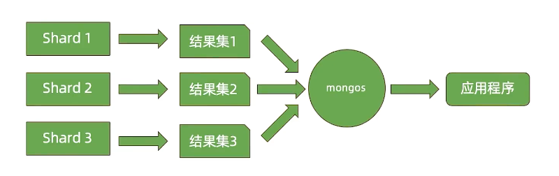

===============================
MongoDB读写性能机制
===============================

一次数据库请求过程中发生了什么？

应用端
===============

选择节点
----------------

- 对于复制集读操作，选择那个节点是由readPreference决定的：
    - primary/primaryPreferred
    - secondary/secondaryPreferred
    - nearest
- 如果不希望一个远距离节点被选中，应做到以下之一：
    - 将它设置为隐藏节点
    - 通过标签（tag)控制可选的节点
    - 使用nearest方式

排队等待
------------------

- 排队等待连接是如何发送的
    - 总连接数大于允许的最大连接数maxPoolSize
- 如何解决这个问题
    - 加大最大连接数（不一定有用）
    - 优化查询性能

连接与认证
---------------

- 如果一个请求需要等待创建新连接和进行认真， 相比直接从连接池获取连接，他将耗费更长的时间
- 可能解决的方案：
    - 设置minPoolSize（最小连接数）一次性创建足够的连接
    - 避免突发大量的请求

数据库端
===================

.. image:: ../_static/mongodb/img/img_136.png
    :align:  center

排队等待
-----------------

- 由ticket不足引起的排队等待， 问题往往不在ticket本身， 而在于为什么正在执行的操作会长时间占用ticket
- 可能解决方案：
    - 优化CRUD性能 可以减少ticket占用时间
    - zlib压缩方式也可能引起ticket不足， 因为zlib算法本身在进行压缩、解压时需要的时间比较场，从而造成

执行请求（读）
-----------------------

执行请求（写）
--------------------------

合并结果
------------------

- 如果顺序不重要则不要排序
- 尽可能使用带片键的查询条件以减少参与查询的分片数

网络的考量
=====================

性能瓶颈总结
=====================

