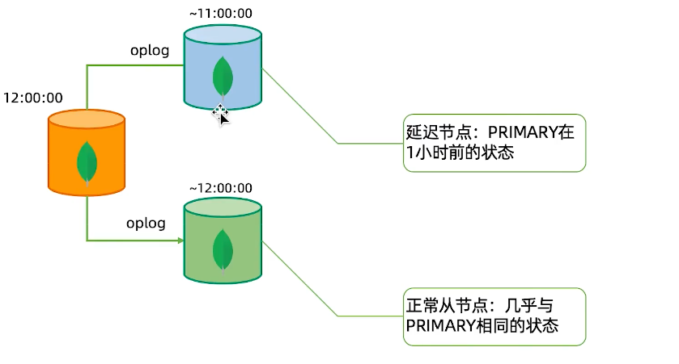
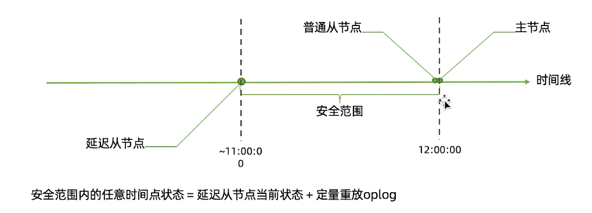
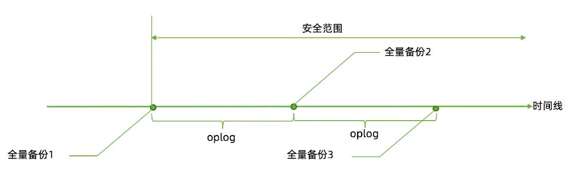
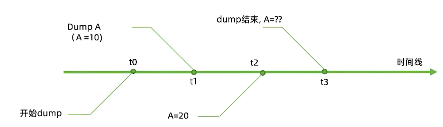
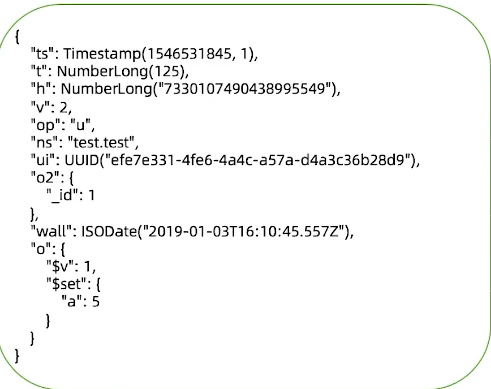
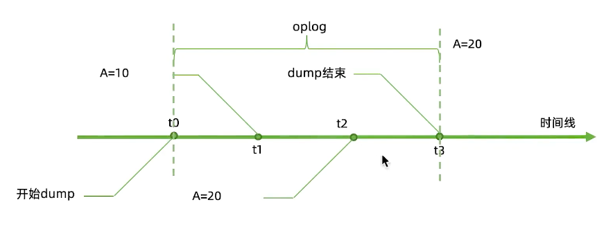
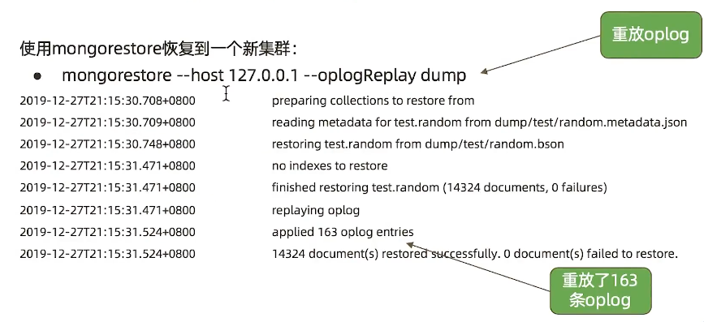

================================================
MongoDB 备份(mongodump)与恢复(mongorestore)
================================================

何为备份
==============

备份的目前：

- 防止硬件故障引起的数据丢失
- 防止认为错误误删数据
- 时间回溯
- 监管要求

第一点MongoDB产生集群已经通过复制集的多节点实现， 本讲的备份主要是为其他几个目的

MongoDB的备份机制分为：

- 延迟节点备份
- 全量备份 + Oplog 增量

最常见的全量备份方式包括：

- mongodump
- 复制数据文件
- 文件系统快照

方案一 ： 延迟节点备份
==============================

方案二： 全量备份加 Oplog
==================================

- 最近的oplog 已经在 oplog.rs 集合中， 因此可以在定期从集合中导出便得到了 oplog
- 如果主节点上的oplog.rs 集合足够打， 全量备份足够密集， 自然也可以不用备份oplog
- 只要有覆盖整个时间段的oplog， 就可以结合全量备份得到任意时间点的备份

复制文件全量备份注意事项
---------------------------

复制数据库文件：

- 必须先关闭节点才能复制， 否知复制到的文件无效
- 也可以选择 db.fsyncLock()锁定节点， 但完成后不要忘记db.fsyncUnlock()解锁
- 可以且因该在从节点上完成
- 该方法实际上会暂时宕机一个从节点， 所以整个过程中应注意投片节点总数

文件系统快照
-------------------

- MongoDB支持使用文件系统快照直接获取数据文件在某一时刻的镜像
- 快照过程中可以不用停机
- 数据文件 和 Journal 必须在同一个卷上
- 快照完成后请尽快复制文件并删除快照

mongodump全量备份注意事项
--------------------------------

mongodump:

- 使用mongodump备份最为灵活， 但速度上也是最慢的
- mongodump出来的数据不能表示某个时间点， 只是某个时间段

解决方案： 幂等性
^^^^^^^^^^^^^^^^^^^^^^^^^

- 假设集合有两个文档:
    - {_id:1, a:1}
    - {_id:2, b:0}
- 考虑以下三条oplog：
    - 将_id 为1 的记录的 a 字段更新为 5
    - 将_id 为1 的记录的 a 字段更新为10
    - 将_id 为2 的记录的 b 字段更新为20

这三条oplog顺序执行， 无论执行多少次， 最终得到结果均是：
`{_id:1, a:10},{_id:2, b=20}`

用幂等性解决一致性问题
^^^^^^^^^^^^^^^^^^^^^^^^^^^^^

备份和回复工具参数
============================

几个重要参数：

    - mongodump
        - --oplog: 复制mongodump 开始到结束过程中的所有oplog并输出到结果中。输出文件位于dump/oplog.bson
    - mongorestore
        - --oplogReplay: 回复完数据文件后在重放oplog， 默认重发dump/oplog.bson 如果oplog不在这里则可以：
        - --oplogFile: 指定需要重放的oplog文件位置
        - --oplogLimit: 重放oplog时截止到指定的时间

示例
=========

前提
-------------

需要有 mongodb的工具包

`工具包下载地址 <https://www.mongodb.com/try/download/database-tools>`_

下载选项：

.. image:: ../_static/mongodb/img/img_17.png
    :align: center

这里我们选择 tgz 下载，下载完安装包，并解压 tgz（以下演示的是 64 位 Linux上的安装:
::

    wget https://fastdl.mongodb.org/tools/db/mongodb-database-tools-rhel70-x86_64-100.5.2.tgz
    tar -xvf mongodb-database-tools-rhel70-x86_64-100.5.2.tgz  # 解压
    cd mongodb-database-tools-rhel70-x86_64-100.5.2/bin  # cd到工具包中的bin目录
    mv ./* /usr/local/mongodb/bin/  # 将解压后得文件移动到指定目录下

mongodump
----------------

在Mongodb中我们使用mongodump命令来备份MongoDB数据。该命令可以导出所有数据到指定目录中。

mongodump命令可以通过参数指定导出的数据量级转存的服务器。

语法
^^^^^^^^^^^^

mongodump命令脚本语法如下：
::

    >mongodump -h dbhost -d dbname -o dbdirectory

参数说明
 - -h：MongoDB 所在服务器地址，例如：127.0.0.1，当然也可以指定端口号：127.0.0.1:27017
 - -d：需要备份的数据库实例，例如：test
 - -o：备份的数据存放位置，例如：c:\data\dump，当然该目录需要提前建立，在备份完成后，系统自动在dump目录下建立一个test目录，这个目录里面存放该数据库实例的备份数据。

在本地使用 27017 启动你的mongod服务。打开命令提示符窗口，进入MongoDB安装目录的bin目录输入命令mongodump:
::

    >mongodump

执行以上命令后，客户端会连接到ip为 127.0.0.1 端口号为 27017 的MongoDB服务上，并备份所有数据到 bin/dump/ 目录中。命令输出结果如下：

mongorestore
---------------------
mongodb使用 mongorestore 命令来恢复备份的数据。

语法
^^^^^^^^^^^^^

mongorestore命令脚本语法如下：
::

    >mongorestore -h <hostname><:port> -d dbname <path>

参数说明
 - --host <:port>, -h <:port>：
    MongoDB所在服务器地址，默认为： localhost:27017
 - --db , -d ：需要恢复的数据库实例，例如：test，当然这个名称也可以和备份时候的不一样，比如test2

 - --drop：恢复的时候，先删除当前数据，然后恢复备份的数据。就是说，恢复后，备份后添加修改的数据都会被删除，慎用哦！

 - <path>：mongorestore 最后的一个参数，设置备份数据所在位置，例如：c:\data\dump\test。你不能同时指定 <path> 和 --dir 选项，--dir也可以设置备份目录。

 - --dir：指定备份的目录，你不能同时指定 <path> 和 --dir 选项。

接下来我们执行以下命令:
::

    [root@sanye home]# /usr/local/mongodb/bin/mongorestore dump
    # dump 为 备份数据的文件夹
    # 以下为导入信息
    2022-04-08T17:17:29.268+0800    preparing collections to restore from
    2022-04-08T17:17:29.268+0800    reading metadata for mock.orders from dump/mock/orders.metadata.json
    2022-04-08T17:17:29.280+0800    restoring mock.orders from dump/mock/orders.bson
    2022-04-08T17:17:32.269+0800    [########################]  mock.orders  115MB/115MB  (100.0%)
    2022-04-08T17:17:32.273+0800    [########################]  mock.orders  115MB/115MB  (100.0%)
    2022-04-08T17:17:32.273+0800    finished restoring mock.orders (100000 documents, 0 failures)
    2022-04-08T17:17:32.273+0800    no indexes to restore for collection mock.orders
    2022-04-08T17:17:32.273+0800    100000 document(s) restored successfully. 0 document(s) failed to restore.

实例二
=================

为了模拟dump过程中的数据变化， 我们开启一个循环插入数据的线程：
::

    for(var i = 0; i<100000; i++){
        db.random.insertOne({x:Math.random()*100000})
    }

在另一个窗口中我们对齐进行mongodump:
::

    mongodump -h 127.0.0.1:27017 --oplog

mongodump/mongorestore
------------------------------

得到一下目录：
::

    dump
    |---admin
    |   |-----system.version.bson
    |   |-----system.version.metadata.json
    |---oplog.bson  # oplog
    |---test
        |--- random.bson   # 数据文件
        |--- random.metadata.json  # 集合元数据

更复杂的重放oplog
=====================

假设全量备份已经恢复到数据库中（无论使用快照、mongodump或复制数据文件的方式），要重放一部分增量怎么办？

- 导主节点上的oplog：
    - mongodump --host 127.0.0.1 -d local -c oplog.rs
    - 可以通过 --query参数添加时间范围
- 使用bsondump查看导出的oplog, 找到需要截止的时间点：
    - 例如: `{"op":"i","ns":"test.random","ui":{"$binary":{"base64":"9G/NuwKlToWbqDBRnq84bw==","subType":"04"}},"o":{"_id":{"$oid":"62616217e02a9a77660d7fdd"},"x":{"$numberDouble":"75393.73107331782"}},"ts":{"$timestamp":{"t":1650549271,"i":21}},"t":{"$numberLong":"1"},"v":{"$numberLong":"2"},"wall":{"$date":{"$numberLong":"1650549271949"}}}`
- 恢复到指定时间点
    - 利用 --oplogLimit 指定恢复到这条记录之前
    - mongorestore -h 127.0.0.1 --oplogLimit "1577355175:1" --oplogFile dump/local/oplog.rs

分片集备份
====================

分片集备份大致与复制集原理相同， 不过存在一下差异：

- 应分别为每个分片和config备份
- 分片集备份不仅要考虑一个分片内的一致性问题， 还要考虑分片间的一致性问题，因此每个片要能够恢复到同一个时间点

分片集的增量备份
----------------------

尽管理论上我们可以使用与复制集相同的方式来为分片集完成增量备份，但实际上分片集的情况更加复杂，这种复杂性来自两个方面：、

- 各个数据节点的时间不一致：每个数据节点很难完全恢复到一个真正的一致时间点上，通常只能做到大致一致，而这种大致一致通常足够好，除了以下情况
- 分片间的数据迁移：当一部分数据从一个片迁移到另一个片时， 最终数据到底在哪里取决于config中的元数据。如果元数据于数据节点之间的时间差异正好导致数据时间已经迁移到新分片上，而元数据仍然认为数据在旧分片上，就会导致数据丢失情况。虽然这种情况发生的概率很小，但仍有可能导致问题

要避免上述问题的发送， 只有定期停止均衡器， 只有在均衡器停止期间，增量回复才能保证正确