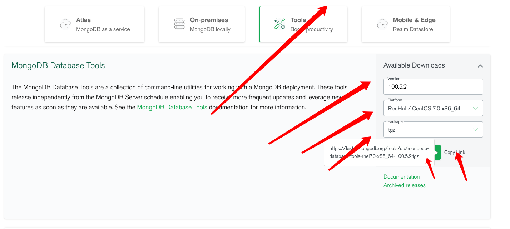

================================================
MongoDB 备份(mongodump)与恢复(mongorestore)
================================================

前提
======
需要有 mongodb的工具包

`工具包下载地址 <https://www.mongodb.com/try/download/database-tools>`_

下载选项：

这里我们选择 tgz 下载，下载完安装包，并解压 tgz（以下演示的是 64 位 Linux上的安装:
::

    wget https://fastdl.mongodb.org/tools/db/mongodb-database-tools-rhel70-x86_64-100.5.2.tgz
    tar -xvf mongodb-database-tools-rhel70-x86_64-100.5.2.tgz  # 解压
    cd mongodb-database-tools-rhel70-x86_64-100.5.2/bin  # cd到工具包中的bin目录
    mv ./* /usr/local/mongodb/bin/  # 将解压后得文件移动到指定目录下

MongoDB数据备份
==================
在Mongodb中我们使用mongodump命令来备份MongoDB数据。该命令可以导出所有数据到指定目录中。

mongodump命令可以通过参数指定导出的数据量级转存的服务器。

语法
------
mongodump命令脚本语法如下：
::

    >mongodump -h dbhost -d dbname -o dbdirectory

参数说明
 - -h：MongoDB 所在服务器地址，例如：127.0.0.1，当然也可以指定端口号：127.0.0.1:27017
 - -d：需要备份的数据库实例，例如：test
 - -o：备份的数据存放位置，例如：c:\data\dump，当然该目录需要提前建立，在备份完成后，系统自动在dump目录下建立一个test目录，这个目录里面存放该数据库实例的备份数据。

实例
--------
在本地使用 27017 启动你的mongod服务。打开命令提示符窗口，进入MongoDB安装目录的bin目录输入命令mongodump:
::

    >mongodump

执行以上命令后，客户端会连接到ip为 127.0.0.1 端口号为 27017 的MongoDB服务上，并备份所有数据到 bin/dump/ 目录中。命令输出结果如下：

MongoDB数据恢复
==================
mongodb使用 mongorestore 命令来恢复备份的数据。

语法
--------
mongorestore命令脚本语法如下：
::

    >mongorestore -h <hostname><:port> -d dbname <path>

参数说明
 - --host <:port>, -h <:port>：
    MongoDB所在服务器地址，默认为： localhost:27017
 - --db , -d ：需要恢复的数据库实例，例如：test，当然这个名称也可以和备份时候的不一样，比如test2

 - --drop：恢复的时候，先删除当前数据，然后恢复备份的数据。就是说，恢复后，备份后添加修改的数据都会被删除，慎用哦！

 - <path>：mongorestore 最后的一个参数，设置备份数据所在位置，例如：c:\data\dump\test。你不能同时指定 <path> 和 --dir 选项，--dir也可以设置备份目录。

 - --dir：指定备份的目录，你不能同时指定 <path> 和 --dir 选项。

接下来我们执行以下命令:
::

    [root@sanye home]# /usr/local/mongodb/bin/mongorestore dump
    # dump 为 备份数据的文件夹
    # 以下为导入信息
    2022-04-08T17:17:29.268+0800    preparing collections to restore from
    2022-04-08T17:17:29.268+0800    reading metadata for mock.orders from dump/mock/orders.metadata.json
    2022-04-08T17:17:29.280+0800    restoring mock.orders from dump/mock/orders.bson
    2022-04-08T17:17:32.269+0800    [########################]  mock.orders  115MB/115MB  (100.0%)
    2022-04-08T17:17:32.273+0800    [########################]  mock.orders  115MB/115MB  (100.0%)
    2022-04-08T17:17:32.273+0800    finished restoring mock.orders (100000 documents, 0 failures)
    2022-04-08T17:17:32.273+0800    no indexes to restore for collection mock.orders
    2022-04-08T17:17:32.273+0800    100000 document(s) restored successfully. 0 document(s) failed to restore.

