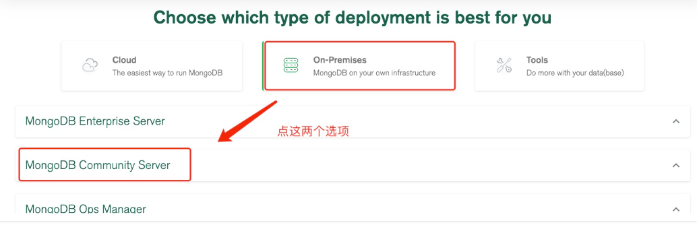

============
MongoDB 安装
============

下载
========

下载地址:
::

    https://www.mongodb.com/try/download/enterprise

下载选择:

这里我们选择 tgz 下载，下载完安装包，并解压 tgz（以下演示的是 64 位 Linux上的安装:
::

    wget https://fastdl.mongodb.org/linux/mongodb-linux-x86_64-rhel70-5.0.6.tgz  # 下载压缩包
    tar -xvf mongodb-linux-x86_64-rhel70-5.0.6.tgz  # 解压
    mv mongodb-linux-x86_64-rhel70-5.0.6 /usr/local/mongodb  # 将解压后得文件移动到指定目录下

MongoDB 的可执行文件位于 bin 目录下，所以可以将其添加到 PATH 路径中：
::

    export PATH=<mongodb-install-directory>/bin:$PATH

<mongodb-install-directory> 为你 MongoDB 的安装路径。如本文的 /usr/local/mongodb4:
::

    export PATH=/usr/local/mongodb4/bin:$PATH

创建数据库目录
=================

默认情况下 MongoDB 启动需要以下两个目录：
 - 数据存储目录：/var/lib/mongodb(可以自定义文件路径)
 - 日志文件目录：/var/log/mongodb(可以自定义文件路径)

我们在启动前可以先创建这两个目录并设置当前用户有读写权限：
::

    sudo mkdir -p /var/lib/mongo
    sudo mkdir -p /var/log/mongodb
    sudo chown `whoami` /var/lib/mongo     # 设置权限
    sudo chown `whoami` /var/log/mongodb   # 设置权限

接下来启动 Mongodb 服务：
::

    [root@sanye lib]# mongod --dbpath /var/lib/mongo --logpath /var/log/mongodb/mongod.log --fork
    # 以下信息为 启动成功返回
    about to fork child process, waiting until server is ready for connections.
    forked process: 11221
    child process started successfully, parent exiting

打开 /var/log/mongodb/mongod.log 文件看到以下信息，说明启动成功。
::

    # tail -10f /var/log/mongodb/mongod.log
    2020-07-09T12:20:17.391+0800 I  NETWORK  [listener] Listening on /tmp/mongodb-27017.sock
    2020-07-09T12:20:17.392+0800 I  NETWORK  [listener] Listening on 127.0.0.1
    2020-07-09T12:20:17.392+0800 I  NETWORK  [listener] waiting for connections on port 27017
