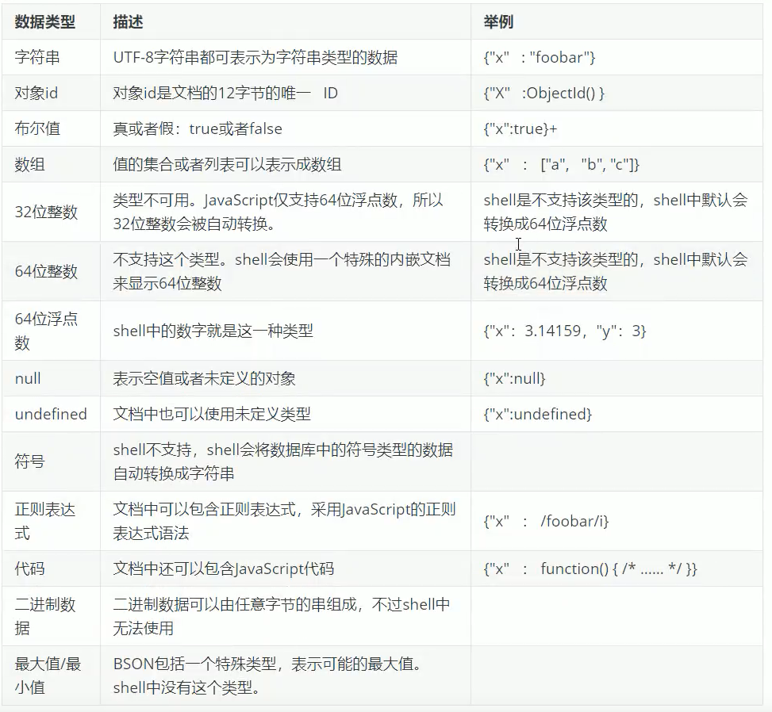

============
MongoDB 简介
============

MongoDB是一个开源、 高性能、 无模式的文档型数据库， 是NoSQL数据库产品中的一种，是最像
关系型数据库（Mysql）的非关系型数据库

他支持的数据结构非常松散， 是一种类似于JSON的格式 叫 BSON

MongoDB 中的记录是一个文档， 它是一个由字段和值对组成的数据结构，
MongoDB文档类似于JSON对象， 即一
个文档人文就是一个对象， 字段的数据类型是字符型，
他的值除了使用基本的一些类型歪， 还可以包括其他文档、 普通数组和文档数组

体系结构
========

数据结构
========

