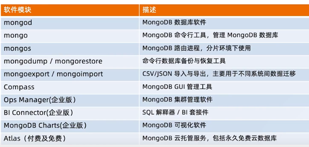
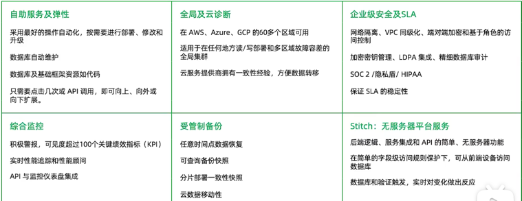
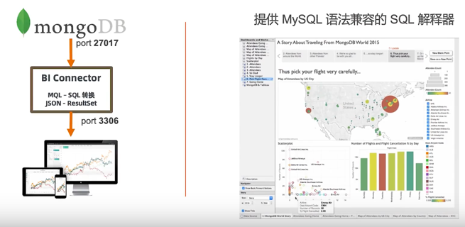
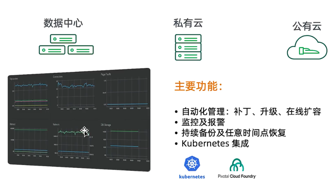
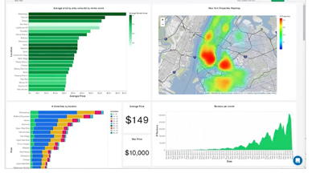

===================
MongoDB全家桶
===================

mongodump / mongorestore
============================
- 类似于Mysql的 dump/restore 工具
- 可以完成全库dump ： 不加条件
- 也可以根据条件进行dump ： -q参数
- Dump的同时跟踪数据就更： --oplog参数
- Restore 是反操作， 把mongodump的输出导入到mongodb

简单实例：
::

    mongodump -h 127.0.0.1:27017 -d test -c test
    mongorestore -h 127.0.0.1:27017 -d test -c test xx.bson

Atlas 公有云托管服务
====================

MongoDB BI Connector
========================

MongoDB Ops Manager 集群管理平台
=====================================

MongoDB Charts
======================

- 托拉拽创建MongoDB图表
- 创建、分享和嵌入MongoDB数据可视化的最快、最便捷方式
- 专为MongoDB文档模型设计
- 一行代码在你网页应用程序中嵌入图表

