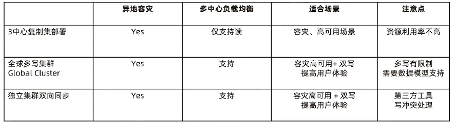
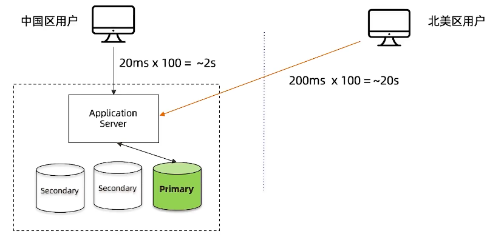
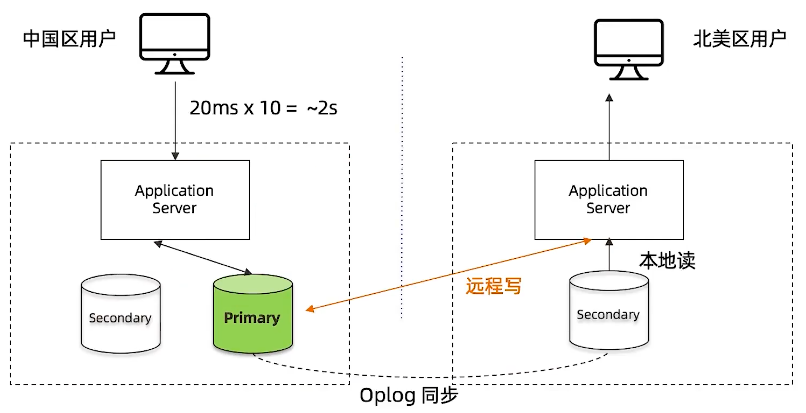
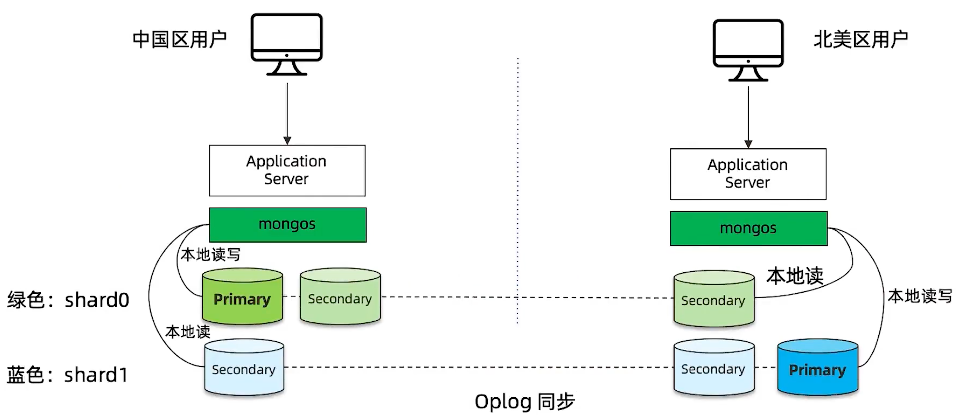
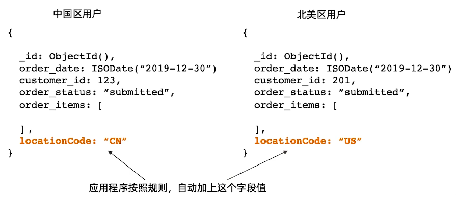
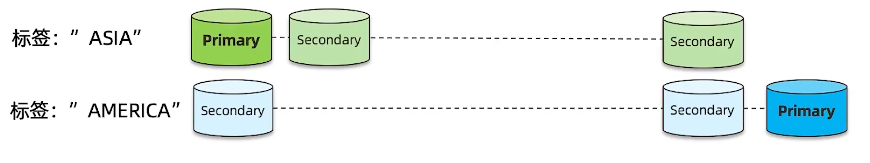
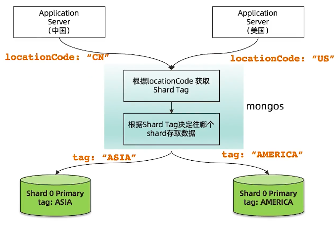
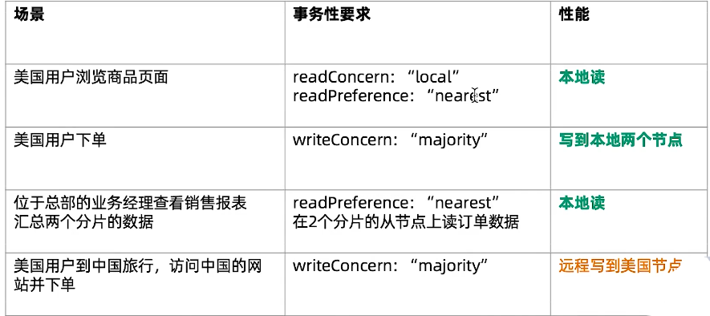
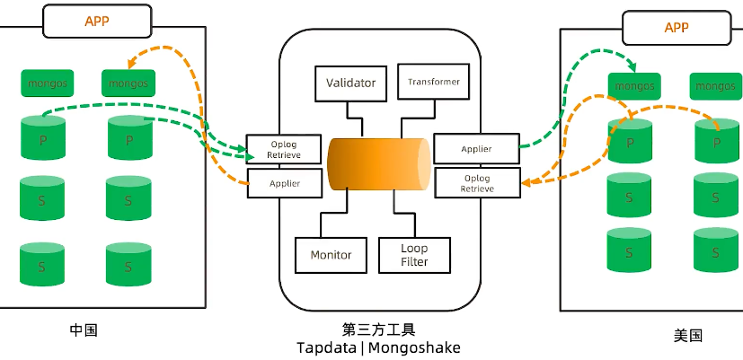

========================
全球多写
========================

MongoDB多中心部署的三种模式
=====================================

全球化业务需求
=========================

- 某奢侈品牌厂商业务集中在大中华地区
- 明年 的 目标是进入 美国市场
- 他们的业务系统都集中在香港
- 如何设计我们的业务系统来保证海外用户的体验

远距离访问无法保证用户体验
===================================

MongoDB复制集 - 只解决了读的问题
============================================

MongoDB Zone Sharding - 全球集群
============================================

Zone Sharding 设置步骤
----------------------------

- 针对每个要分片的数据集合， 模型中增加一个区域字段
- 给集群的每个分片加区域标签
- 给每个区域指定属于这个区域的分片块范围（chunk range）

1 数据模型：增加区域字段
^^^^^^^^^^^^^^^^^^^^^^^^^^^^^^^^^^^^^^

2 给分片添加标签
^^^^^^^^^^^^^^^^^^^^^^^^^^^^^^^

::

    # mongo
    > sh.addShardTag('shard0', 'ASIA')
    > sh.addShardTag('shard1', 'AMERICA')

3 标签指定数据块范围
^^^^^^^^^^^^^^^^^^^^^^^^^^^^^^^^

::

    # mongo
    >sh.addTagRange(
        'crm.orders',
        {'locationCode':'CN', order_id:MinKey},
        {'locationCode':'CN', order_id:MaxKey},
        'ASIA'
    )
    >sh.addTagRange(
        'crm.orders',
        {'locationCode':'US', order_id:MinKey},
        {'locationCode':'US', order_id:MaxKey},
        'AMERICA'
    )
    >sh.addTagRange(
        'crm.orders',
        {'locationCode':'CA', order_id:MinKey},
        {'locationCode':'CA', order_id:MaxKey},
        'AMERICA'
    )

MongoDB Zone Sharding 工作原理
---------------------------------------

读写场景分析
------------------------

独立集群模式 - 需要外部工具双向同步
===========================================

