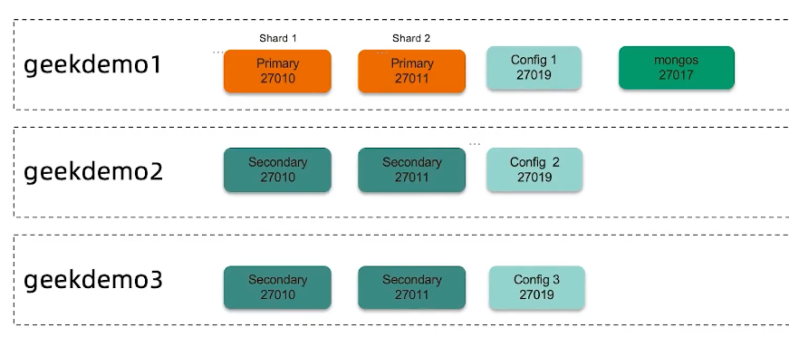
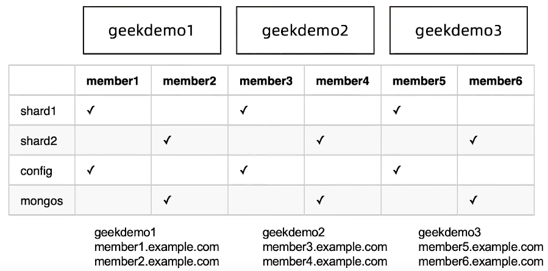

=======================
分片集群搭建及扩容
=======================

目标及流程
=================

- 目标： 学习如何搭建一个2分片的分片集群
- 环境： 3 台 Linux 虚拟机， 4Core 8 GB
- 步骤：
    - 配置域名解析
    - 准备分片目录
    - 创建一个分片复制集并初始化
    - 创建config 复制集并初始化
    - 初始化分片集群， 加入第一个分片
    - 创建分片表
    - 加入第二个分片

实验架构
======================

1 配置域名解析
=====================

在3台虚拟机上分别执行以下3条命令， 主要替换实际IP地址:
::

    echo '192.168.1.1 geekdemo1 menber1.example.com member2.example.com' >> /etc/host
    echo '192.168.1.2 geekdemo2 menber3.example.com member4.example.com' >> /etc/host
    echo '192.168.1.3 geekdemo3 menber5.example.com member6.example.com' >> /etc/host

2 准备分片目录
=====================

在各服务器上创建数据目录， 我们使用 '/data'， 请按自己需要修改的其他目录：

- 在member1/member3/member5 上执行 以下命令：
::

    mkdir -p /data/shard1/
    mkdir -p /data/config/

- 在member2/member4/member6 上执行以下命令：
::

    mkdir -p /data/shard2/
    mkdir -p /data/mongos/

3 创建第一个分片用的复制集
==============================

在member1/member3/member5 上执行以下命令：
::
    mongod --bind_ip 0.0.0.0 --replSet shard1 --dbpath /data/shard1 --logpath /data/shard1/mongod.log --port 27010 --fork --shardsvr --wiredTigerCacheSizeGB 1

4 初始化第一个分片复制集
================================

::

    mongo --host member1.example.com:27010
    re.initiate({
        _id:"shard1",
        "members":[
            {"_id":0, "host":"member1.example.com:27010"},
            {"_id":1, "host":"member3.example.com:27010"},
            {"_id":2, "host":"member5.example.com:27010"}
        ]
    })

5 创建 config server 复制集
===================================

在member1/member3/member5 上执行以下命令：
::

    mongod --bind_id 0.0.0.0 --replSet config --dbpath /data/config --logpath /data/config/mongod.log --port 27019 --fork --configsvr --wiredTigerCacheSizeGB 1

6 初始化 config server 复制集
======================================

::

    mongo --host member1.example.com:27019
    re.initiate({
        _id:"config",
        "members":[
            {"_id":0, "host":"member1.example.com:27019"},
            {"_id":1, "host":"member3.example.com:27019"},
            {"_id":2, "host":"member5.example.com:27019"}
        ]
    })

7 在第一台机器上搭建mongos
=================================

::
    # 启动mongos服务
    mongos --bind_id 0.0.0.0 --logpath /data/mongos/mongos.log --port 27017 --fork --configdb config/member1.example.com:27019,member3.example.com:27019,member5.example.com:27019
    # 连接到mongos
    mongo --host member1.example.com:27017
    mongos>
    sh.addShard("shard1/member1.example.com:27010,member3.example.com:27010,member5.example.com:27010")