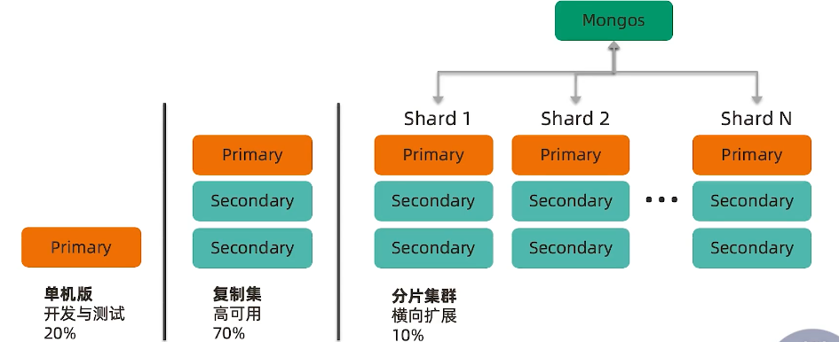
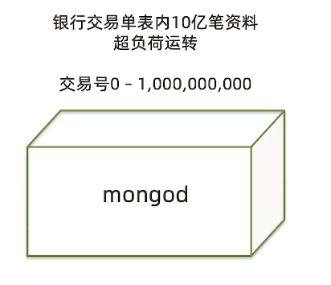
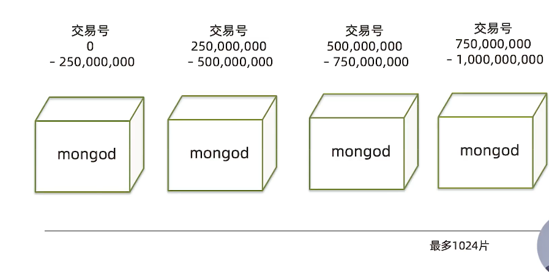
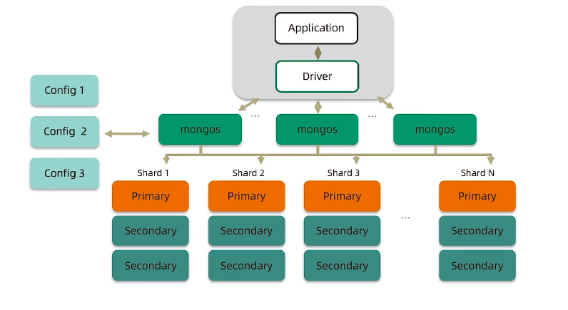
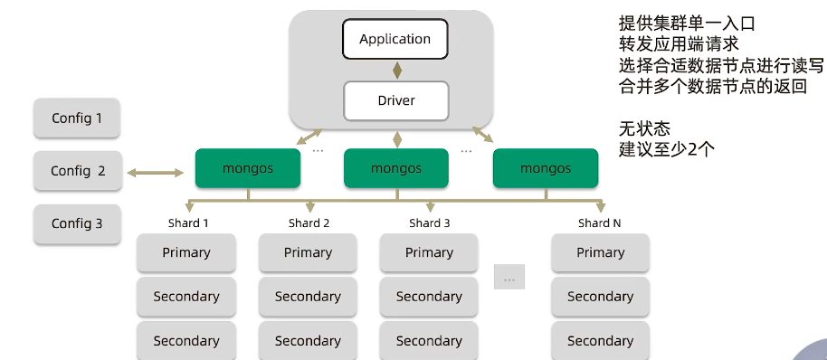
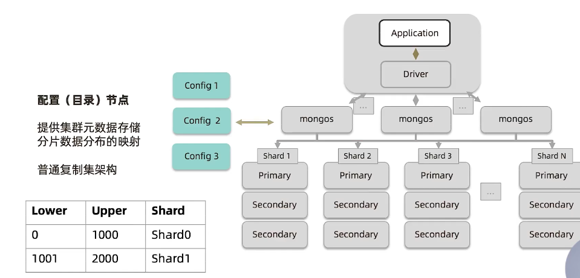
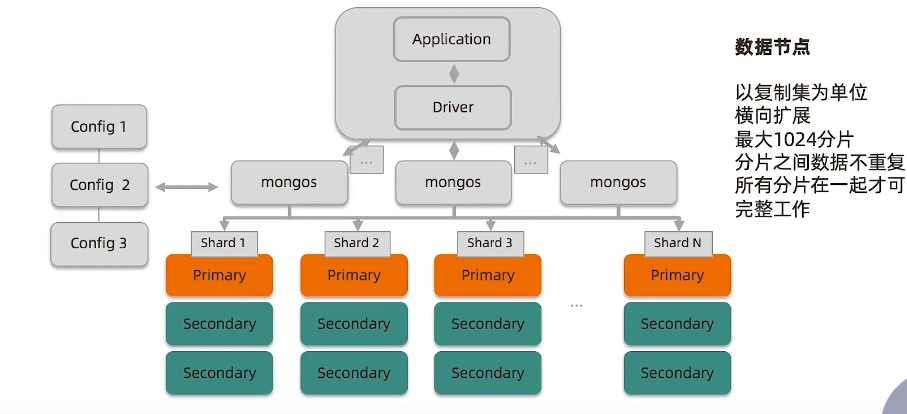
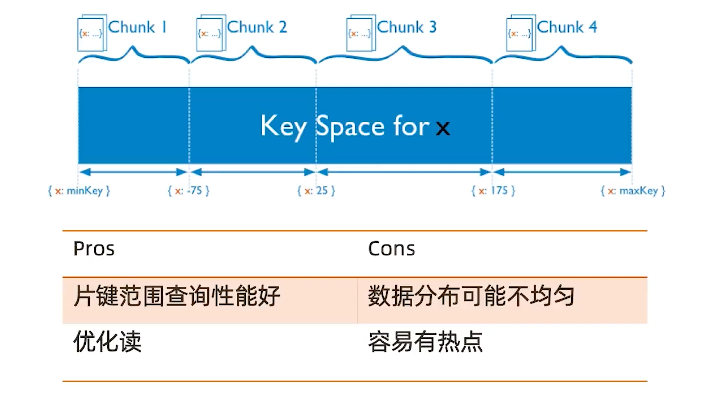
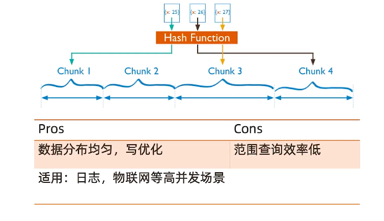
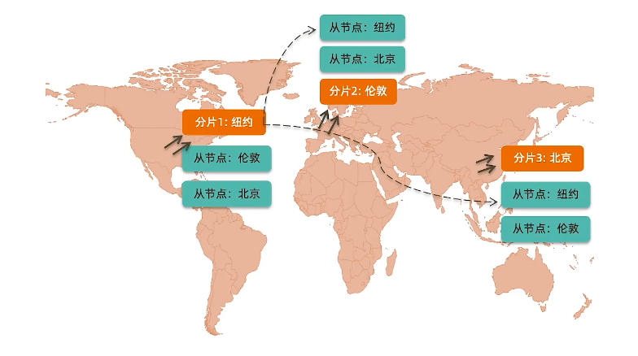

==============================
分片集群机制及原理
==============================

MongoDB 常见部署架构
=============================

为什么要使用分片集群
===========================

- 数据容量日益增大， 访问性能日渐降低，怎么破？
- 新品上线异常火爆， 如何支撑更多的并发用户?
- 单库已有10TB数据， 恢复需要1 -2 天， 如何加速？
- 地理分布分析

分片如何解决
====================

把数据分成两半， 放到两个库里面
----------------------------------

把数据分成四部分， 放到四个库里面
---------------------------------------

完整的分片集群
========================

分片集群解剖
================================

路由节点mongos
------------------

配置节点
-----------------------

数据节点mongod
----------------------

MongoDB分片集群特点
=========================

- 应用全透明，无特殊处理
- 数据自动均衡
- 动态扩容， 无需下线
- 提供三种分片方式

分片集群数据分片方式
----------------------

- 基于范围
- 基于Hash
- 基于 zone / tag

基于范围
^^^^^^^^^^^^^^^^

基于Hash
^^^^^^^^^^^^^^^^^^^

自定义Zone
^^^^^^^^^^^^^^^^^^^^

小结
=============

- 分片集群可以有效解决性能瓶颈及系统扩容问题
- 分片额外消耗较多， 管理复杂， 尽量不要分片
- 如果实在要用，请仔细设计。

