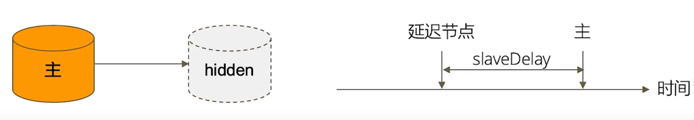

===============
mongodb复制集
===============

复制集的作用
=============
 - MongoDB复制集的主要意义在于实现服务高可用
 - 他的实现依赖于两个方面的功能：
    - 数据写入时将数据迅速复制到另一个独立节点上
    - 在接受写入的节点发生故障时自动选举出一个新的代替节点
 - 在实现高可用的同时，复制集实现了以下几个附加功能
    - 数据分发：将数据从一个区域复制到另一个区域，减少另一个区域的读延迟
    - 读写分离：不同类型的压力分布在不同的节点上执行
    - 异地容灾：在数据中心故障时迅速的切换到异地

典型复制集的结构
=================
 - 一个经典的复制集由3个以上具有投票权的节点组成，包括：
    - 一个主节点(primary) ： 接受写入操作和选举时投票
    - 两个或多个从节点(secondary) ：复制主节点上的新数据和选举时投票
    - 不推荐使用投票节点（Arbiter）

数据是如何复制的
=================
 - 当一个修改操作，无论是插入、更新或是删除，到达主节点时,他对数据的操作将被记录下来(经过一些必要的转换),这里记录被称为oplog
 - 从节点通过在主节点上打开一个tailable游标不断获取新进入主节点的oplog,并在自己的数据上回放，以此保持更主节点数据一致

通过选举完成故障修复
========================

 - 具有投票权的节点之间两两发送心跳；
 - 当5次心跳未收到时判断为节点失联；  (默认为每2秒钟 发送一次)
 - 如果失联的是主节点， 从节点会发起选举, 选出新的主节点；
 - 如果失联的是从节点， 则不会发起选举；
 - 选举基于`RAFT一致性算法`实现， 选举成功的必要条件是大多数投票节点存活；
 - 复制集最多可以有50个节点，但具有投票权的节点最多7个

选举影响的因素
===============
 - 整个集群必须有大多数节点存活；
 - 被选举为主节点的节点必须条件：
    - 能够与多数节点建立连接
    - 具有较新的oplog
    - 具有较高的优先级(如果有配置)

常见选项
==============

- 复制集节点有以下几个常用的选配项：
    - 是否具有投票权（v参数） ： 有则参与投票；
    - 优先级(priority参数) ： 优先级越高的节点越优先成为主节点。优先级为0的节点无法成为主节点
    - 隐藏(hidden参数) ： 复制数据， 但对应用不可见。 隐藏节点具有投票权，但优先级必须为0
    - 延迟(slaveDelay参数) ： 复制n秒之前的数据，保持与主节点的时间差

复制集的注意事项
===================
- 关于硬件
    - 因为正常的复制集节点都有可能成为主节点，他们的地位是一样的，因此硬件配置必须一致
    - 为了保证节点不会同时宕机，各节点使用的硬件必须具有独立性
- 关于软件
    - 复制集各节点的版本必须一致，以避免出现不可预支的问题
- 增加节点不会增加系统写性能

启动复制集实例
=================

1、创建数据目录
-------------------

MongoDB启动时将使用一个数据目录存放所有的数据文件。我们将为3个复制集节点创建各自的数据目录。

Linux/MacOS:
::

    mkdir -p /data/db{1,2,3}

Windows:
::

    md c:\data\db1
    md c:\data\db2
    md c:\data\db3

2、准备配置文件
----------------------

复制集的每个mongodb进程因该位于不同的服务器。 我们现在在一台机器上运行3个进程,因此要为他们各自配置

- 不同的端口。 实例中使用的是28017、28018、28019
- 不同的数据目录。 实例中使用的是：
    - /data/db1 或 c:\data\db1
    - /data/db2 或 c:\data\db2
    - /data/db3 或 c:\data\db3
- 不同的日志文件路径。 实例中使用的是：
    - /data/db1/mongodb.log 或 c:\data\db1\mongodb.log
    - /data/db2/mongodb.log 或 c:\data\db2\mongodb.log
    - /data/db3/mongodb.log 或 c:\data\db3\mongodb.log

配置文件模板:
::

    /data/db1/mongod.conf
    systemLog:
      destination: file
      path: /data/db1/mongodb.log  # log path
      logAppend: true
    storage:
      dbPath: /data/db1  # data path
    net:
      bindIp: 0.0.0.0  # host
      port: 28017  # port
    replication:   # 有这个参数的话 说明是一个复制集 , 否则是一个单节点
      replSetName: rs0  # 复制集的名字
    processManagement:
      fork: true  # 以后台运行

复制并修改对应的参数 到 db2 db3 中:
::

    [root@sanye data]# cp db1/mongod.conf db2/
    [root@sanye data]# cp db1/mongod.conf db3/
    # 复制做对应的修改

3、启动进程
----------------
启动这三个进程:
::

    mongod -f db1/mongod.conf
    mongod -f db2/mongod.conf
    mongod -f db3/mongod.conf

    ps -ef|grep mongod  # 查看进程
    # 如下 三个节点都启动成功
    [root@sanye data]# ps -ef |grep mongod
    root     31495     1  1 20:15 ?        00:00:01 mongod -f db1/mongod.conf
    root     31562     1  1 20:15 ?        00:00:01 mongod -f db2/mongod.conf
    root     31629     1  1 20:15 ?        00:00:01 mongod -f db3/mongod.conf
    root     31769 30100  0 20:17 pts/0    00:00:00 grep --color=auto mongod

4、配置复制集
-------------------

方法一：
::

    # 注意： 此方法 需要  hostname能被解析
    # hostname -f -->>  sanye
    mongo -port 28017  # 进入mongodb客户端
    > rs.initiate() # 初始化
    {
            "info2" : "no configuration specified. Using a default configuration for the set",
            "me" : "sanye:28017",
            "ok" : 1
    }
    # 这里的命令提示符 从 ">" 变为了 "rs0:OTHER>"  说明已经进入了复制集的状态
    # rs0:OTHER> rs.add("HOSTNAME:28018")  # 添加节点  HOSTNAME 为 sanye
    rs0:OTHER> rs.add("sanye:28018")  # 执行这句
    {
            "ok" : 1,
            "$clusterTime" : {
                    "clusterTime" : Timestamp(1649506909, 1),
                    "signature" : {
                            "hash" : BinData(0,"AAAAAAAAAAAAAAAAAAAAAAAAAAA="),
                            "keyId" : NumberLong(0)
                    }
            },
            "operationTime" : Timestamp(1649506909, 1)
    }
    # 这里的命令提示符 从 "rs0:OTHER>" 变为了 "rs0:PRIMARY>"
    # 说明 从刚初始化后得OTHER 变为了 PRIMARY 主节点
    # rs0:PRIMARY> rs.add("HOSTNAME:28019")  # HOSTNAME 为 sanye
    rs0:PRIMARY> rs.add("sanye:28019")
    {
            "ok" : 1,
            "$clusterTime" : {
                    "clusterTime" : Timestamp(1649506913, 1),
                    "signature" : {
                            "hash" : BinData(0,"AAAAAAAAAAAAAAAAAAAAAAAAAAA="),
                            "keyId" : NumberLong(0)
                    }
            },
            "operationTime" : Timestamp(1649506913, 1)
    }

方法二：
::

    mongo -port 27017  # 进入mongodb客户端
    > rs.initiate({
        _id:"rs0",
        members:[
            {_id:0,host:"localhost:27017"},
            {_id:1,host:"localhost:27018"},
            {_id:2,host:"localhost:27019"}
        ]
    }) # 初始化 并 添加节点

5、验证复制集是否正常工作
----------------------------

MongoDB主节点写入:
::

    mongo -port 28017
    > db.test.insertOne({name:'test'})
    {
            "acknowledged" : true,
            "insertedId" : ObjectId("62517ec02e80344dd8a42d0b")
    }
    > db.test.insertOne({name:'test1'})
    {
            "acknowledged" : true,
            "insertedId" : ObjectId("62517ec72e80344dd8a42d0c")
    }

MongoDB从节点读:
::

    mongo -port 28018
    > db.test.find()
    { "_id" : ObjectId("62517ec02e80344dd8a42d0b"), "name" : "test" }
    { "_id" : ObjectId("62517ec72e80344dd8a42d0c"), "name" : "test1" }

    mongo -port 28019
    > db.test.find()
    { "_id" : ObjectId("62517ec02e80344dd8a42d0b"), "name" : "test" }
    { "_id" : ObjectId("62517ec72e80344dd8a42d0c"), "name" : "test1" }

注意：
::

    mongo -p 28018  -->>  这个 -p  代表的 password
    mongo -port 28018   -->>  复制集模式  这个才是指定端口
    当以复制集模式登录时 会出现不允许读的情况
    rs0:SECONDARY> db.test.find()
    Error: error: {
            "topologyVersion" : {
                    "processId" : ObjectId("625178e0bd187d6c6c47700e"),
                    "counter" : NumberLong(10)
            },
            "ok" : 0,
            "errmsg" : "not master and slaveOk=false",
            "code" : 13435,
            "codeName" : "NotPrimaryNoSecondaryOk",
            "$clusterTime" : {
                    "clusterTime" : Timestamp(1649509229, 1),
                    "signature" : {
                            "hash" : BinData(0,"AAAAAAAAAAAAAAAAAAAAAAAAAAA="),
                            "keyId" : NumberLong(0)
                    }
            },
            "operationTime" : Timestamp(1649509229, 1)
    }
    此时需要执行 rs.slaveOk()  # 老版本5.X之前
    新版本会出现 警告： WARNING: slaveOk() is deprecated and may be removed in the next major release. Please use secondaryOk() instead.
    最好执行：rs.secondaryOk()
