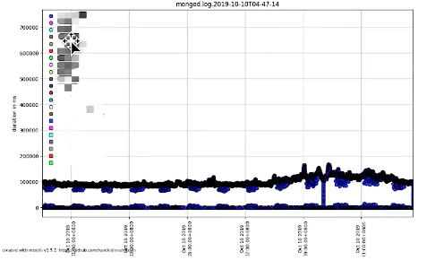

=======================
性能诊断工具
=======================

mongostat
==================

mongostat常用命令格式：
---------------------------

`mongostat --host xxx --username root --password 12345678 --authenticationDatabase admin`

mongostat参数说明：
::

    --host :指定IP地址和端口，也可以只写IP，然后使用--port参数指定端口号
    --username： 如果开启了认证，则需要在其后填写用户名
    --password : 不用多说，肯定是密码
    --authenticationDatabase：若开启了认证，则需要在此参数后填写认证库（注意是认证上述账号的数据库）

各字段解释说明
-----------------------

- insert/s : 官方解释是每秒插入数据库的对象数量，如果是slave，则数值前有*,则表示复制集操作
- query/s : 每秒的查询操作次数
- update/s : 每秒的更新操作次数
- delete/s : 每秒的删除操作次数
- getmore/s: 每秒查询cursor(游标)时的getmore操作数
- command: 每秒执行的命令数，在主从系统中会显示两个值(例如 3\|0),分表代表 本地\|复制命令
    - 注： 一秒内执行的命令数比如批量插入，只认为是一条命令（所以意义应该不大）
- dirty: 仅仅针对WiredTiger引擎，官网解释是脏数据字节的缓存百分比
- used: 仅仅针对WiredTiger引擎，官网解释是正在使用中的缓存百分比
- flushes:
    - For WiredTiger引擎：指checkpoint的触发次数在一个轮询间隔期间
    - For MMAPv1 引擎：每秒执行fsync将数据写入硬盘的次数
- qrw: 排队的请求
- conn: 连接数量

注：一般都是0，间断性会是1， 通过计算两个1之间的间隔时间，可以大致了解多长时间flush一次。flush开销是很大的，如果频繁的flush，可能就要找找原因了
::

    mongostat --username superuesr --authenticationDatabase admin
    # mongostat: 用于了解MongoDB运行状态的工具
    insert query update delete getmore command dirty used flushes vsize  res qrw arw net_in net_out conn    time
    *0    *0     *0     *0       0     0|0      0.0% 0.0%       0 1.55G 113M 0|0 1|0   111b   52.5k    3  Apr 25 14:43:47.670
    *0    *0     *0     *0       0     1|0      0.0% 0.0%       0 1.55G 113M 0|0 1|0   112b   52.6k    3  Apr 25 14:43:48.669
    *0    *0     *0     *0       0     1|0      0.0% 0.0%       0 1.55G 113M 0|0 1|0   112b   52.6k    3  Apr 25 14:43:49.669
    *0    *0     *0     *0       0     0|0      0.0% 0.0%       0 1.55G 113M 0|0 1|0   111b   52.5k    3  Apr 25 14:43:50.669
    *0    *0     *0     *0       0     1|0      0.0% 0.0%       0 1.55G 113M 0|0 1|0   112b   52.6k    3  Apr 25 14:43:51.669
    *0    *0     *0     *0       0     0|0      0.0% 0.0%       0 1.55G 113M 0|0 1|0   111b   52.5k    3  Apr 25 14:43:52.671
    *0    *0     *0     *0       0     1|0      0.0% 0.0%       0 1.55G 113M 0|0 1|0   112b   52.7k    3  Apr 25 14:43:53.669
    *0    *0     *0     *0       0     0|0      0.0% 0.0%       0 1.55G 113M 0|0 1|0   111b   52.4k    3  Apr 25 14:43:54.671

    # dirty 超过20%时阻塞新请求
    # used 超过95%时阻塞新请求

mongotop
====================

用于了解集合压力状态的工具
相比mongostat，mongotop输出的内容有限

mongostat常用命令格式：
---------------------------

`mongotop --host xxx --username root --password 12345678 --authenticationDatabase admin`

mongotop参数说明：
::

    --host :指定IP地址和端口，也可以只写IP，然后使用--port参数指定端口号
    --username： 如果开启了认证，则需要在其后填写用户名
    --password : 不用多说，肯定是密码
    --authenticationDatabase：若开启了认证，则需要在此参数后填写认证库（注意是认证上述账号的数据库）

各字段解释说明
-----------------------

- ns，集合名字
- total：读写花费时间(单位是ms)  总时间
- read：读花费时间
- write：写花费时间

mongotop输出的内容表示每个集合的每个表读写情况，它打印了每个库里面读写花费的时长，单位是ms，可以帮助快速定位读写瓶颈。

mongotop这个命令只运行一次，如果想每间隔一段时间，就运行一次，则可以使用：`mongotop 30`

这样的写法，可以让mongotop命令每30s运行一次，这样可以持续的检测mongodb的运行状态。

::

                        ns    total    read    write    2022-04-25T15:11:49+08:00
                 acme.test      0ms     0ms      0ms
      admin.$cmd.aggregate      0ms     0ms      0ms
        admin.system.roles      0ms     0ms      0ms
         admin.system.users      0ms     0ms      0ms
      admin.system.version      0ms     0ms      0ms
    config.system.sessions      0ms     0ms      0ms
       config.transactions      0ms     0ms      0ms
      local.system.replset      0ms     0ms      0ms
                 test.test      0ms     0ms      0ms

mongod日志
==================

日志中记录执行超过100ms的查询及其执行计划

mtools
================

- 安装:`pip install mtools`
- 常用指令：
    - mplotqueries 日志文件： 将所有慢查询通过图表形式展示
    - mloginfo --queries 日志文件： 总结出所有慢查询的模式和出现次数、消耗时间等

