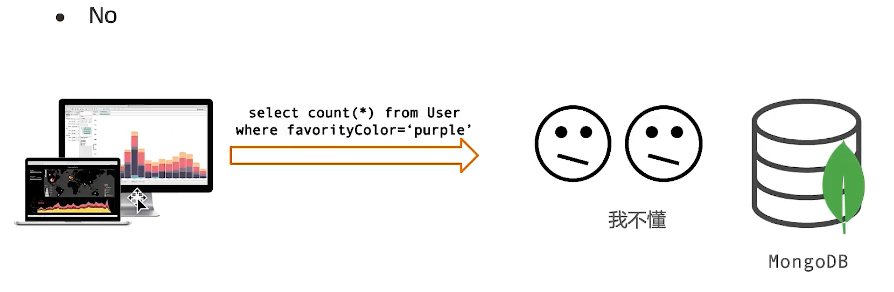
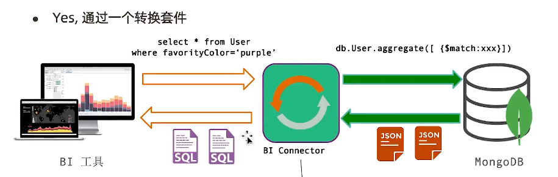
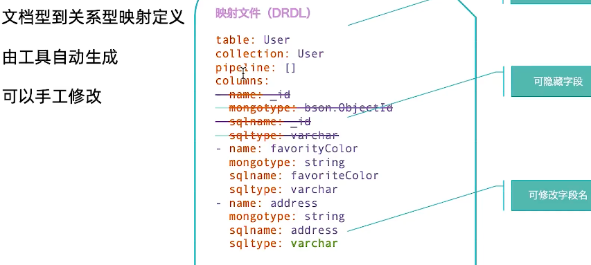

======================
MongoDBSQL套接件
======================

Mongodb 支持 SQL方式查询吗？
==================================

文档型到关系型映射定义 有工具自动生成 可以手工修改

关于 BI 套接件
==================

- 独立于MongoDB 运行的服务
- MongoDB 企业版组件
- 免费仅限于开发环境
- MySQL 协议兼容， 可以使用MySQL 客户端连接'

.. code-block:: shell

    [root@sanye bin]# ./mongosqld --mongo-uri localhost:27013 --addr 0.0.0.0:3307
    2022-05-06T16:46:19.024+0800 I CONTROL    [initandlisten] mongosqld starting: version=v2.14.4 pid=25413 host=sanye
    2022-05-06T16:46:19.024+0800 I CONTROL    [initandlisten] git version: df0cf0b57e9aac0ab6d545eee0d4451d11d0c6e9
    2022-05-06T16:46:19.024+0800 I CONTROL    [initandlisten] OpenSSL version OpenSSL 1.0.1e-fips 11 Feb 2013 (built with OpenSSL 1.0.1e 11 Feb 2013)
    2022-05-06T16:46:19.024+0800 I CONTROL    [initandlisten] options: {net: {bindIp: [0.0.0.0]}, mongodb: {net: {uri: "localhost:27013"}}}
    2022-05-06T16:46:19.024+0800 I CONTROL    [initandlisten] ** WARNING: Access control is not enabled for mongosqld.
    2022-05-06T16:46:19.024+0800 I CONTROL    [initandlisten]
    2022-05-06T16:46:19.029+0800 I NETWORK    [initandlisten] waiting for connections at [::]:3307
    2022-05-06T16:46:19.029+0800 I NETWORK    [initandlisten] waiting for connections at /tmp/mysql.sock
    2022-05-06T16:46:19.051+0800 I SCHEMA     [sampler] sampling MongoDB for schema...
    2022-05-06T16:46:19.079+0800 I SCHEMA     [sampler] mapped schema for 2 namespaces: "testdemo" (2): ["test", "user"]

测试连接：
::

    mysql --protocol=tcp --port=3307

    mysql> show databases;
    +--------------------+
    | Database           |
    +--------------------+
    | INFORMATION_SCHEMA |
    | mysql              |
    | testdemo           |
    +--------------------+
    mysql> use testdemo;
    mysql> show tables;
    +--------------------+
    | Tables_in_testdemo |
    +--------------------+
    | test               |
    | user               |
    +--------------------+

MongoDB BI 套接件 小结
===============================

- 一个官方提供SQL解析器
- 只支持查询， 不支持增删改查
- 因为经过一个额外的节点， 性能和原生聚合框架相比有损耗
- 复杂的SQL 查询， 功能上支持， 但是性能上 建议要根据实际情况压测