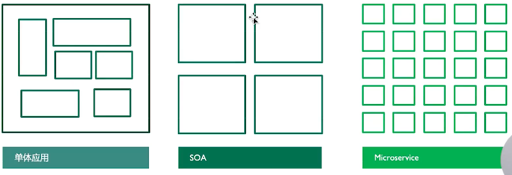
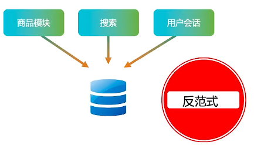
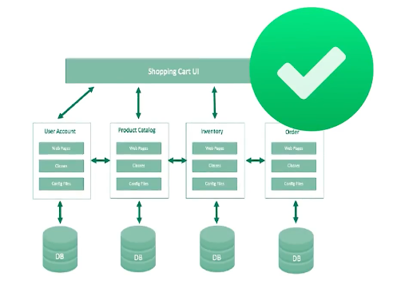
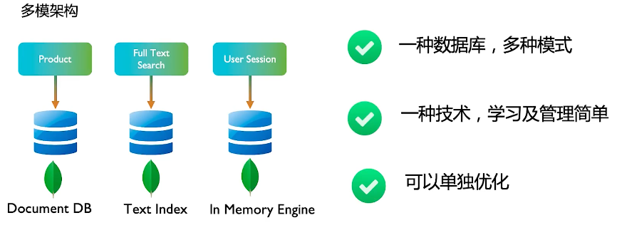
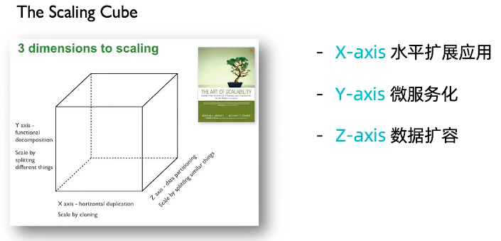

===============================
MongoDB与微服务
===============================

微服务 vs SOA vs 单体应用
==================================

微服务的优势
===================

- 开发速度快
- 变化响应快
- 易维护
- 扩容简单

微服务架构设计要素
===========================

- Decouple 服务解耦
- Dumb Pipes  HTTP API - 接口简单
- Decentralize  数据去中心化
- DevOps  持续继承自动部署

微服务的数据架构设计考量点
============================

- 一服一库  还是 多服一库
- 混合持久化 还是 多模数据库
- 扩容便捷性

多个微服务共享一个数据库
===============================

一个（逻辑）数据库为所有微服务使用

- 单点故障， 一个性能问题可能拖垮整个服务群
- 容易引起强关联， 不利 解耦
- 难以为某一个微服务单独扩容

关键微服务使用自己专用的数据库
============================================

- 每个微服务使用一个逻辑库
- 数据库变动时候不影响其他服务

混合持久化
===================

多模数据库
=====================

是否可以快速扩容
======================

MongoDB的扩容能力
=========================

| Elastic scalability 弹性伸缩
| Auto Balancing      自动均衡

MongoDB 容器化部署
=========================

MongoDB是一个有状态的服务， 在容器化部署时候要特别注意：
    - 复制集节点要能够相互通讯： 配置的时候要使用服务名，或者固定的服务IP地址
    - 使用 Persistent Volume  或 类似的长久存储
    - 使用Ops Manager 进行集群管理（而不是K8S/Openshift)
