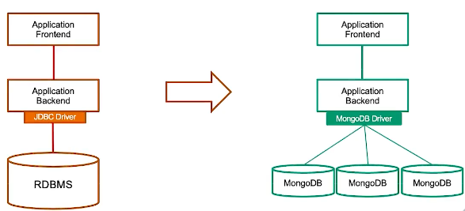
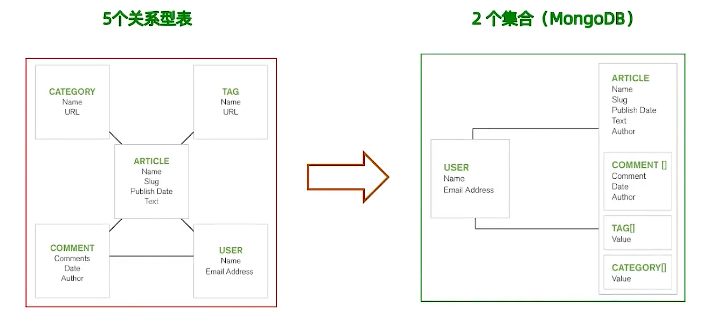
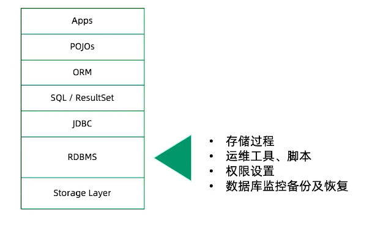
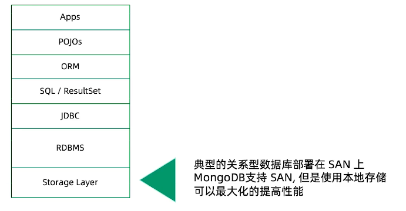
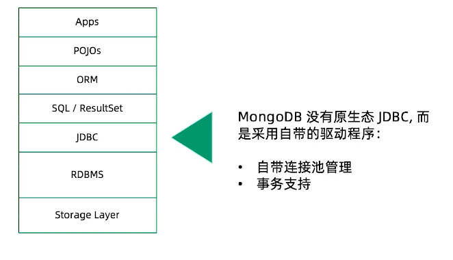
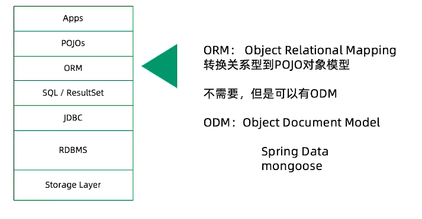
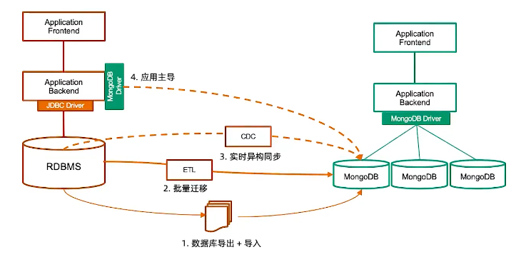

============================
关系型数据库迁移
============================

从基于关系型数据库应用迁移到MongoDB的理由
===================================================

- 高并发需求（数千--数十万ops）， 关系型数据库不容易扩展
- 快速迭代 - 关系型模型太严谨
- 灵活的Json模式
- 大数据量需求
- 地理位置查询
- 多数据中心跨地域部署

应用迁移难度
====================================

- 关系型到关系型 - 相对简单
    - Oracle -> MySQL, Oracle -> PostgreSQL
- 关系型到文档型 - 相对复杂
    - Oracle -> MongoDb
- 需要考虑：
    - 总体架构（从单体式到分布式）
    - 模式设计（从关系模型到文档模型）
    - SQL语句 / 存储过程 / JDBC / ORM
    - 数据迁移（如何处理已有数据？）

总体架构
====================

从单体到分布式， 需要考虑：
    - 3X 的计算资源
    - 3X 的储存资源
    - 网络

模式设计
==================

针对已有关系模型， 考虑如何用文档模型进行设计

迁移的主战场
===================

硬件存储
-------------

JDBC
---------------

SQL
-------------------

.. image:: ../../_static/mongodb/img/img_181.png
    :align: center

ORM
-------------------

数据迁移
=====================

- 迁移时应用往往已经上线相当长一段时间， 如何迁移这些数据到MongoDB
    - 数据库导出 + 导入
    - 批量迁移工具
    - 实时同步工具
    - 应用主导迁移

数据库迁移方式及工具
==========================

1 数据库导入导出
-------------------------

步骤:
    - 停止现有的基于RDBMS的应用
    - 使用RDBMS的数据库导出工具， 将数据库表导出到CSV 或者JSON （如mysqldump）
    - 使用mongoimport将CSV或者JSON文件导入MongoDB数据库
    - 启动新的MongoDB应用

备注：
    - 使用与一次性数据迁移
    - 需要应用/ 数据库下线， 较长的下线时间

mysql - mongo
^^^^^^^^^^^^^^^^^^^^^^

::

    mysqldump database_name -h host -u user -p -T mysql_files

    cat customers.txt

    mongoimport -d database_name -c customers --type==csv --headerline customers.txt
