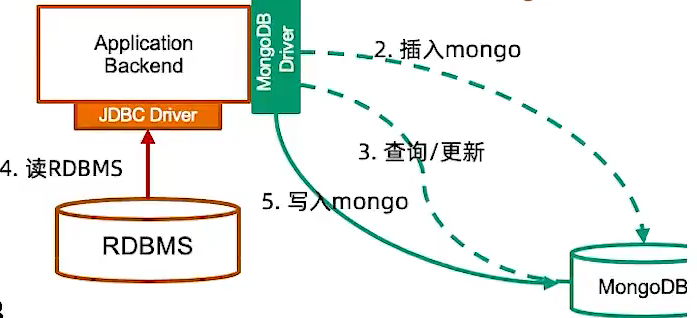
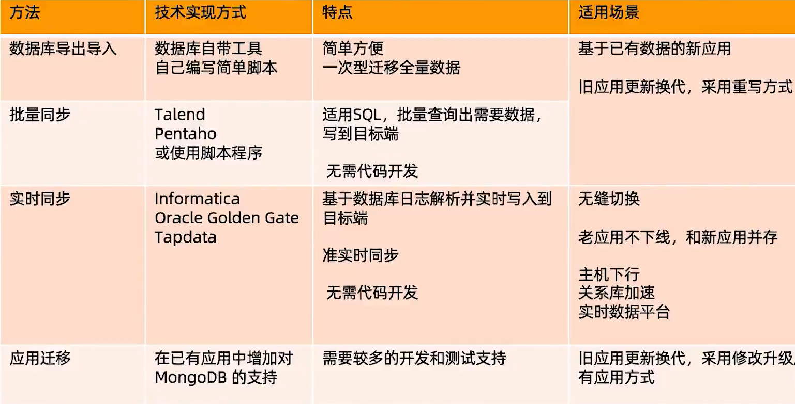

============================
关系型数据库迁移
============================

从基于关系型数据库应用迁移到MongoDB的理由
===================================================

- 高并发需求（数千--数十万ops）， 关系型数据库不容易扩展
- 快速迭代 - 关系型模型太严谨
- 灵活的Json模式
- 大数据量需求
- 地理位置查询
- 多数据中心跨地域部署

应用迁移难度
====================================

- 关系型到关系型 - 相对简单
    - Oracle -> MySQL, Oracle -> PostgreSQL
- 关系型到文档型 - 相对复杂
    - Oracle -> MongoDb
- 需要考虑：
    - 总体架构（从单体式到分布式）
    - 模式设计（从关系模型到文档模型）
    - SQL语句 / 存储过程 / JDBC / ORM
    - 数据迁移（如何处理已有数据？）

总体架构
====================

从单体到分布式， 需要考虑：
    - 3X 的计算资源
    - 3X 的储存资源
    - 网络

.. image:: ../../_static/mongodb/img/img_176.png
    :align: center

模式设计
==================

针对已有关系模型， 考虑如何用文档模型进行设计

.. image:: ../../_static/mongodb/img/img_177.png
    :align: center

迁移的主战场
===================

.. image:: ../../_static/mongodb/img/img_178.png
    :align: center

硬件存储
-------------

.. image:: ../../_static/mongodb/img/img_179.png
    :align: center

JDBC
---------------

.. image:: ../../_static/mongodb/img/img_180.png
    :align: center

SQL
-------------------

.. image:: ../../_static/mongodb/img/img_181.png
    :align: center

ORM
-------------------

.. image:: ../../_static/mongodb/img/img_182.png
    :align: center

数据迁移
=====================

- 迁移时应用往往已经上线相当长一段时间， 如何迁移这些数据到MongoDB
    - 数据库导出 + 导入
    - 批量迁移工具
    - 实时同步工具
    - 应用主导迁移

.. image:: ../../_static/mongodb/img/img_183.png
    :align: center

数据库迁移方式及工具
==========================

1 数据库导入导出
-------------------------

步骤:
    - 停止现有的基于RDBMS的应用
    - 使用RDBMS的数据库导出工具， 将数据库表导出到CSV 或者JSON （如mysqldump）
    - 使用mongoimport将CSV或者JSON文件导入MongoDB数据库
    - 启动新的MongoDB应用

备注：
    - 使用与一次性数据迁移
    - 需要应用/ 数据库下线， 较长的下线时间

mysql - mongo
^^^^^^^^^^^^^^^^^^^^^^

::

    mysqldump database_name -h host -u user -p -T mysql_files

    [root@sanye test]# cd mysql_files
    [root@sanye test]# cat user.txt
        name    age     gander
        123     123     12
        112312  123     21
        123     123     12
        123     123     123
        123     123     3

    mongoimport -d database_name -c customers --type==csv --headerline customers.txt
    [root@sanye test]# mongoimport --port 27013 -d testdemo -c test --type=csv --headerline test.txt
    2022-05-05T16:48:37.587+0800    connected to: mongodb://localhost:27013/
    2022-05-05T16:48:37.652+0800    2 document(s) imported successfully. 0 document(s) failed to import.

2 批量同步
-------------------------

步骤：
    - 安装同步工具（如Kettle/Talend）
    - 创建输入源（关系型数据库）
    - 创建输出源（MongoDB）
    - 编辑数据同步任务
    - 执行

备注：
    - 适用批量同步， 定期更新， 特别是每晚跑批的场景
    - 支持基于时间戳的增量同步， 需要源表有合适的时间戳支持
    - 对源库有较明显的性能影响， 不宜频繁查询
    - 不支持实时同步

.. image:: ../../_static/mongodb/img/img_184.png
    :align: center

3 实时同步
-------------------

步骤：
    - 安装实时同步工具（如Informatica / Tapdata）
    - 创建输入源（关系型数据库）
    - 创建输出源（MongoDB）
    - 编辑实时数据同步任务
    - 执行

备注：
    - 基于源库的日志文件解析机制， 可以实现秒级数据的同步
    - 对源库性能影响较小
    - 可以支持应用的无缝迁移

4 应用主导迁移
--------------------

步骤：
    - 1 升级已有应用支持MongoDB
    - 2 数据插入请求直接进入MongoDB
    - 3 数据查询和更新请求首先定向到MongoDB
    - 4 如果记录不存在， 从RDBMS读出来并写入到MongoDB
    - 5 重复步骤3
    - 6 当步骤4 在限定时间段（一个星期、 一个月）都偶没有被调用， 认为迁移完成

备注：
    - 需要研发团队配合， 有一定开发和测试量
    - 为保证我不遗漏数据， 仍然先要执行一次批量同步

数据迁移方式比较
--------------------------

