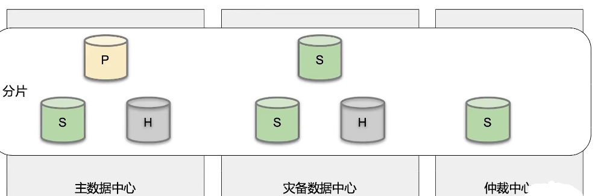

===============================
应用场景及选型
===============================

MongoDB 数据库定位
=========================

- OLTP 数据库
- 原则上 Oracle 和 MySQL 能做的事情， MongoDB都能做（包括ACID事务）
- 优点： 横向拓展能力， 数据量或并发量增加时候架构可以自动扩展
- 优点： 灵活模型， 适合迭代开发， 数据模型多变场景
- 优点： Json数据结构， 适合微服务/REST API

基于功能选择MongoDB
==========================

基于场景选择MongoDB
==========================

移动应用
------------------

场景特点
^^^^^^^^^^^^^^^^^^

- 基于 REST API / JSON
- 快速迭代， 数据结构变化频繁
- 地理位置功能
- 爆发增长可能性
- 高可用

MongoDB选项考量
^^^^^^^^^^^^^^^^^^

- 文档模型可以支持不同的结构
- 原生地理位置功能
- 横向拓展能力支持爆发增长
- 复制集机制快速提供高可用
- 摩拜单车、Keep、ADP

商品信息（电商）
----------------------------

场景特点
^^^^^^^^^^^^^^^^^^

- 商品信息保罗万象
- 商品的属性不同品类差异很大
- 数据库模式设计困难

MongoDB选项考量
^^^^^^^^^^^^^^^^^^

- 文档模型可以集成不同的商品属性
- 可变模型适合迭代
- 京东、小红书、GAP

内容管理
----------------

场景特点
^^^^^^^^^^^^^^^^^^

- 内容数据多样，文本， 图片， 视频
- 扩展困难， 数据量爆发增长

MongoDB选项考量
^^^^^^^^^^^^^^^^^^

- Json结构可以支持非结构化数据
- 分片架构可以解决拓展问题
- Adobe AEM 、 Sitecore

物联网
-------------------------

场景特点
^^^^^^^^^^^^^^^^^^

- 传感器的数据结构往往是半结构化
- 传感器数量很大， 采集频繁
- 数据量很容易增长到数亿到百亿

MongoDB选项考量
^^^^^^^^^^^^^^^^^^

- Json结构可以支持半结构化数据
- 使用分片能力支持海量数据
- Json数据更加容易和其他系统通过REST API 进行集成
- 华为 、 Bosch 、 Mindsphere

Saas应用
------------------

场景特点
^^^^^^^^^^^^^^^^^^

- 多租户模式， 需要服务很多客户
- 需求多变， 迭代压力大
- 数据量增长快

MongoDB选项考量
^^^^^^^^^^^^^^^^^^

- 无模式数据库， 适合快速迭代
- 水平拓展能力可以支持大量用户增长
- ADP 、 Teambition

主机分流
----------------

场景特点
^^^^^^^^^^^^^^^^^^

- 金融行业传统采用IBM或小机
- 传统瀑布开发模式流程长成本高
- 结构不易变， 难于适应新需求
- 根据某银行的统计， 99%的数据库操作为读流量
- 基于MIPS付费， 读流量成本高

MongoDB选项考量
^^^^^^^^^^^^^^^^^^

- 使用实时同步机制， 将数据同步出来到MongoDB
- 使用MongoDB的高性能查询能力来支撑业务的读操作
- 相比于关系型模型数据库，更加容易迁入数据并构建成Json模型进行API服务

实时分析
---------------

场景特点
^^^^^^^^^^^^^^^^^^

- 流数据计算
- 快速计算， 秒级返回

MongoDB选项考量
^^^^^^^^^^^^^^^^^^

- 使用MongoDB缓存机制， 可以利用内存计算加速
- 使用MongoDB聚合框架， 实现分析功能
- 使用微分片架构的并发计算来大量缩减计算时间

关系性数据库替换
--------------------------

场景特点
^^^^^^^^^^^^^^^^^^

- 基于Oracle、MySQL、SQLServer的历史应用
- 数据量增长或者使用者变多以后性能变慢
- 分库分表需要应用配合
- 结构死板，增加新需求复杂困难

MongoDB选项考量
^^^^^^^^^^^^^^^^^^

- 高性能高并发的数据库性能
- 无需应用分库分表，集群自动解决扩容问题
- 动态模拟适合快速开发
- 头条、网易、百度、东航、中国银行

案例一
===================

客户360 ， 世界500强保险公司

业务需求
--------------------

跨国保险公司， 来自60多个国家的9000多万用户，70多套业务系统。客户信息分散在多套系统里， 希望构建一个客户360视图。

第一阶段支撑客服部门更好的服务客户，减少客户等待时间

第二节点构建客户管理手机APP，自助管理所有保单

为了达到这些目的，需要整个70+历史系统中的客户信息， 通过唯一入口查询

业务难点
----------------

- 来自60多个国家的9000万用户， 数据量大
- 70多套不同的保险业务系统的数据需要汇集到一起
- 已有系统在不断迭代，导致最终数据模型不断变化
- 关系数据库的结构变化复杂性高，流程长，往往一个迭代未完成， 源头系统又变化了

关系型 VS MongoDB
------------------------

使用关系数据库的尝试：
    - 历时2年
    - 前后分别使用2个不同的关系型数据库， 连个不同的厂商、团队
    - 花费2500万美元

结果：失败，schema太复杂，无法有效的吧70多套系统的schema融合成一套

使用MongoDB的尝试：
    - 动态数据模型轻松接收不同数据
    - 7 x 24 小时 高可用

结果：2个星期做原型， 3个月上线

系统架构
--------------------

案例小结
---------------------

此案例利用了MongoDB的一下特性：
    - 反范式的数据模型使得复杂数据整合成为可能
    - 高可用（本地 和 跨机房）
        - 故障发生时应用可以自动切换到正常的节点上
        - 可以在秒级时间内完成故障转移， 使得用户体验得到保证

因为这些特性的存在， 使得项目成功

案例二
==================

主机分流（主机下行）  国内四大行之一

业务需求
------------------

为提升用户体验，该银行要在手机银行App中支持实时账户交易历史查询

涉及的数据包括：
    - 借记卡交易历史
    - 信用卡交易历史
    - 后续还将支持股票、基金账户等

对这些交易历史进行整合， 使用户可以看到自己账户的交易历史全貌。涉及的交易数据量：
    - 越6000W交易数据/天， 结息日达到 5以/天
    - 历史存量数据3年， 超过600以
    - 核心系统（主机）支持这样的流量非常困难，成本太高

方案选择： 主机分流
--------------------------

关系型数据库：
    - 超大量数据需要巨大数量的DB实例
    - 考虑高可用，成本极高
    - 分库分表造成开发难度大幅上升
    - 整合不同账户数据时表结构差异大，合并困难

使用MongoDB尝试：
    - 动态数据模型秦松接收不同数据
    - 水平扩展解决数据量大问题
    - 7 X 24 小时可用

系统架构
------------------

案例小结
-------------------

主机分流架构特点：
    - 处理接近每秒1W的交易数据
    - 总量数百亿
    - 查询平均性能数毫秒

本案例中利用了MongoDB的一下特性：
    - 灵活数据模型： 是数据整合更为容易
    - 弹性拓展： 使得海量数据 + 低延迟查询成为可能

案例三
=======================

MySQL迁移  顶级互联网公司

业务场景
---------------

- 旗下多个App
- DAU 7 亿 （活跃用户）
- 42+服务器
- 每天新增30PB数据（包含非结构化）
- 每日线上变更6000+
- 标准数据方案：
    - MySQL + Redis + 对象存储
- 结构化和半结构化在MySQL
- MySQL： 数万台服务器

业务痛点
-----------------

- 数据库变更需要团队配合， 对6000+/天的频繁变更造成很大阻碍
- MySQL集群本身扩容比较困难
- 中间件的约束较多
- 迭速度受影响

新的方向
-------------------

- MongoDB无需中间件， 改善变更效率
- 集群扩容容易
- 结构灵活， 迭代快

MongoDB业务场景
----------------------

在线TP业务
^^^^^^^^^^^^^^^^^^^

- 数据模型多变， 新增collection比较常见
- 低时延和少毛刺
- 请求量大

中台元数据管理
^^^^^^^^^^^^^^^^^^^

- 中台系统， schema需要很多切入式文档
- 数据量大， 点查为主

LBS地理位置
^^^^^^^^^^^^^^^^^^^

- 计算密集， 数据点小， 但是量大
- 写入更新异常频繁

游戏
^^^^^^^^^^^^^^^^^^^

- 游戏日志写入量大， 查询量一般
- 在线分析需求

MongoDB 使用现状
---------------------

其他案例
============================

亿级用户网盘应用
--------------------

挑战：
    - 网盘通讯录， 短信存储管理
    - 网盘文件元数据管理
    - 用户操作日志
    - 数亿用户体量
    - MySQL集群无法支撑性能的诉求

解决方案：
    - 迁移到MongoDB分片集群
    - 快速增长时期没三个月扩容一次
    - 系统2012年上线运行至今
    - 有力支撑业务的持续发展，目前支撑100多个业务
    - 2PB+的数据量存储
    - 100多个分片

技术架构
^^^^^^^^^^^^^^^^^^^

.. image:: ../../_static/mongodb/img/img_175.png
    :align: center

电商平台重构
---------------------

挑战：
    - 电商平台承担数百亿美元的订单
    - 网页性能带来糟糕的用户体验: 页面显示需要超过5秒
    - 平台无法满足市场业务需求的速度， 无法即使发布新功能
    - 传统架构难以用上云架构和DebOps的红利

解决方案：
    - 整个电商平台数据库从Oracle整体迁移到MongoDB
    - 14个关系型表及合成1个集合
    - 60个索引优化到7个
    - 减少12万行代码
    - 3-5秒的页面刷新时间降低到小于1秒

亿级数据量实时分析
-----------------------------

挑战：
    - 服务124个航空公司
    - 每天处理16亿预定相关的请求
    - 需要为乘客提供一个个性化的预定体验， 需要做大量的预先聚合计算

解决方案：
    - 100TB的数据存储在大型MongoDB集群
    - 32台物理机， 288个微分片
    - 一个计算任务在288个微分片上同时执行， 大幅提高分析计算的效率
    - 大型分析场景响应时间在数秒内完成

自然模型主数据存储
----------------------

挑战：
    - 主数据管理需要整合企业多套业务系统的核心数据
    - 传统方式使用关系模型和第三范式
    - 很多精力花在业务逻辑到物理模型的转换，在从物理模型转化为业务逻辑的过程中
    - 客户的数据量很大的时候大量关联导致性能问题

解决方案：
    - 使用MongoDB类存储主数据
    - Json模型比较自然的表现业务的逻辑
    - 查询和写入性能较之于Oracle方案提高了20倍