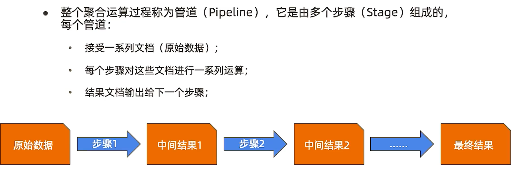
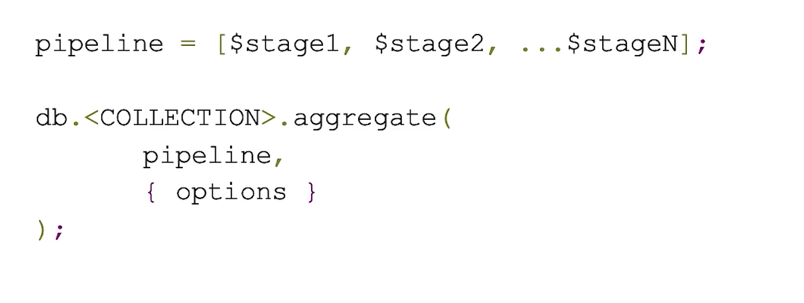
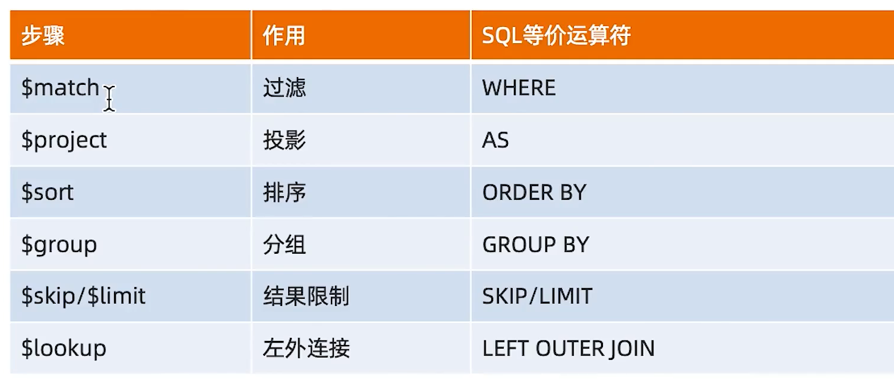
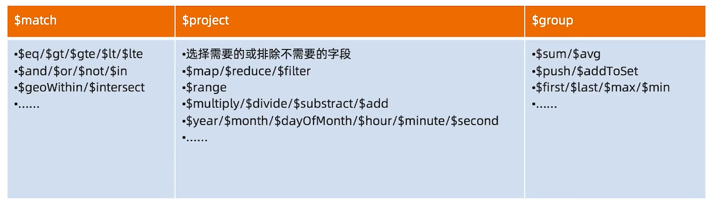
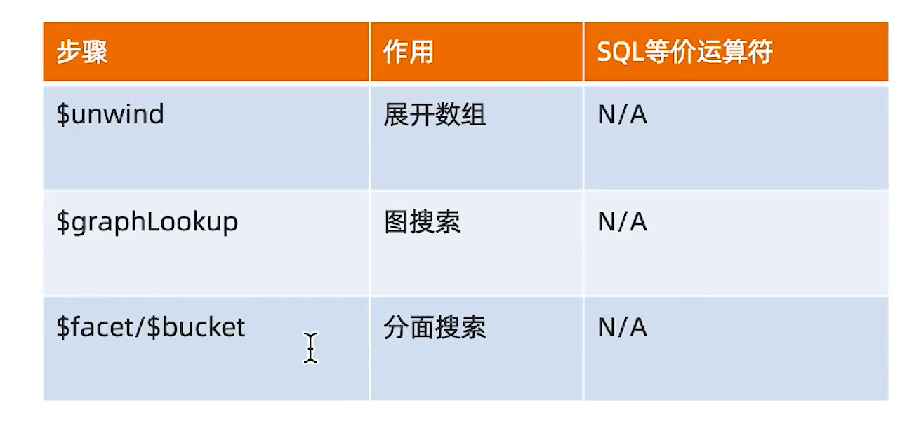
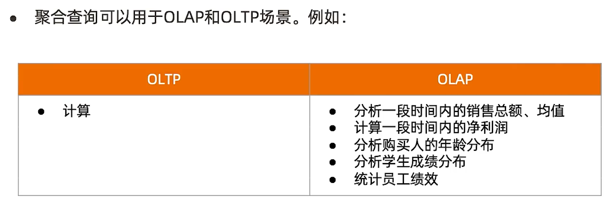
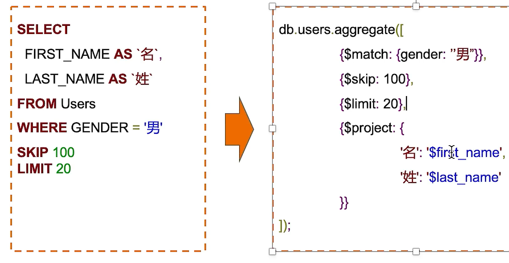
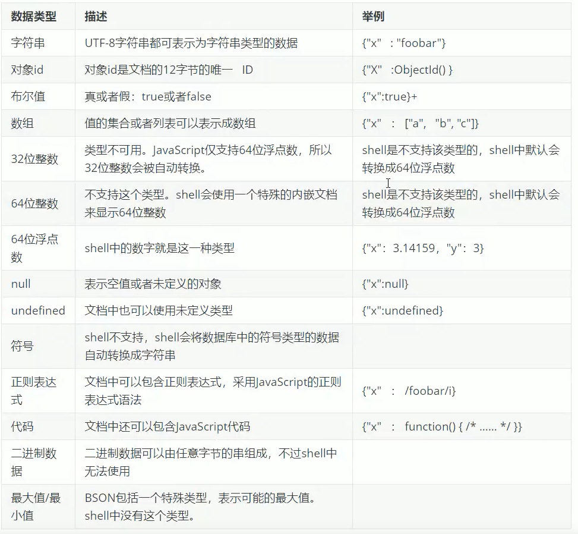

=========
聚合查询
=========

聚合方法名：``aggregate``
聚合关键字::

    $match : 条件判断  (匹配需要的条件)
    $group : 分组
    $project : 投影 （想要展示那些字段）

管道(Pipeline) 和 步骤(Stage)
==============================

聚合运算基本格式
================

常见步骤
============

常见步骤中的运算符
-------------------

比较少见的步骤
--------------

聚合运算的使用场景
====================

SQL 常用步骤与 MQL 对比
==========================

.. image:: ../_static/mongodb/img/img_13 .png
    :align: center

MQL 特有步骤 $unwind
======================
展开数组:
::

    插入数据：
    db.user.insertOne({
        name:"123",
        score:[
            {subject:"数学", score:123},
            {subject:"语文", score:114},
            {subject:"英语", score:44}
        ]})
    查询数据：
    db.user.aggregate([
        {$match:{name:"123"}},
        {$unwind:'$score'}
    ])
    返回数据：
    { "_id" : ObjectId("624feecb31490c4217601da2"), "name" : "123", "score" : { "subject" : "数学", "score" : 123 } }
    { "_id" : ObjectId("624feecb31490c4217601da2"), "name" : "123", "score" : { "subject" : "语文", "score" : 114 } }
    { "_id" : ObjectId("624feecb31490c4217601da2"), "name" : "123", "score" : { "subject" : "英语", "score" : 44 } }

MQL 特有步骤 $bucket
======================

.. image:: ../_static/mongodb/img/img_14 .png
    :align: center

MQL 特有步骤 $facet
======================

.. image:: ../_static/mongodb/img/img_15 .png
    :align: center

例子
=============

总销量
----------
计算到目前为止的所有订单的总销售额

实现如下::

    db.orders.aggregate(
    {
        $group:{
            _id:null,  // 以什么为分组
            total:{$sum:'$total'}  // 新字段 ： 聚合运算符
            }
    })

订单金额汇总
--------------

查询2019年第一季度(1月1日到3月31日) 已完成订单（completed）的订单总金额 和订单总数
实现如下::

    db.orders.aggregate.([
        // 步骤1  先匹配 条件
        {$match:{
            status:completed,
            orderDate:{
                $gte:ISODate('2019-01-01'),
                $lte:ISODate('2019-03-31')
            }
        }},
        // 步骤2 聚合计算 销售额总数 和运费总数 和订单数
        {$group:{
            _id:null,  // 以什么作为分组
            total: {$sum: '$total'},  // 聚合total字段之和
            shippingFee:{$sum: '$shippingFee'},聚合shippingFee字段之和
            count:{$sum:1}  // 聚合 有一天数据  count字段就加一
        }},
        // 步骤3 将 销售总额和运费总额相加
        {$project:{
            grandTotal:{$add:['$total', '$shippingFee']}},  // 将两笔费用相加
            count:1, // 展示 该字段
            _id:0  // 该字段不展示
        }}])

PS
-----

如果觉得凭空想象太困难的话
我们可以使用mongodb官方工具Compass中的Aggregations功能

