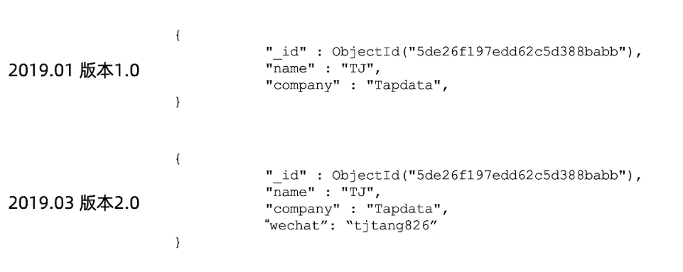
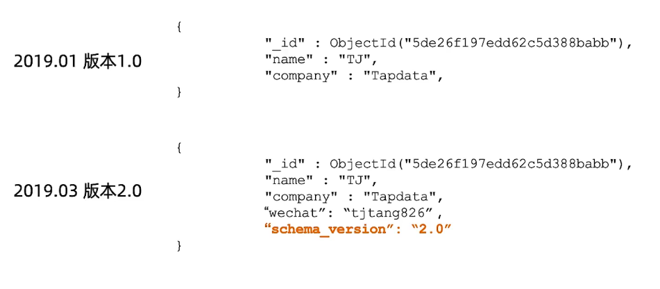

============================
设计模式集锦
============================

问题：大文档，很多字段，很多索引
================================

解决方案：列转行
--------------------

模式小结： 列转行
--------------------

问题： 模型灵活了， 如何管理文档不同版本
============================================

解决方案： 增加一个版本字段
-----------------------------

模式小结： 版本字段
--------------------------------

.. image:: ../_static/mongodb/img/img_60.png
    :align: center

问题： 统计网页点击流量
=============================

解决方案：用近似计算
--------------------------

模式小结：近似计算
------------------------

 .. image:: ../_static/mongodb/img/img_63.png
    :align: center

问题： 业绩排名， 游戏排名， 商品统计等精确统计
===================================================

| 热销榜： 某个商品今天买了多少， 这个星期买了多少， 这个月买了多少
| 电影排行：观影者， 场次统计
| 传统解决方案： 通过聚合计算
| 游戏排行：。。。。。
| 痛点： 消耗资源多， 聚合计算时间长

解决方案： 用预聚合字段
------------------------------

 .. image:: ../_static/mongodb/img/img_64.png
    :align: center

模式小结：预聚合
--------------------

 .. image:: ../_static/mongodb/img/img_65.png
    :align: center
