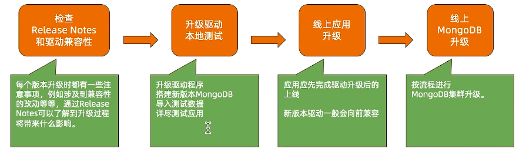
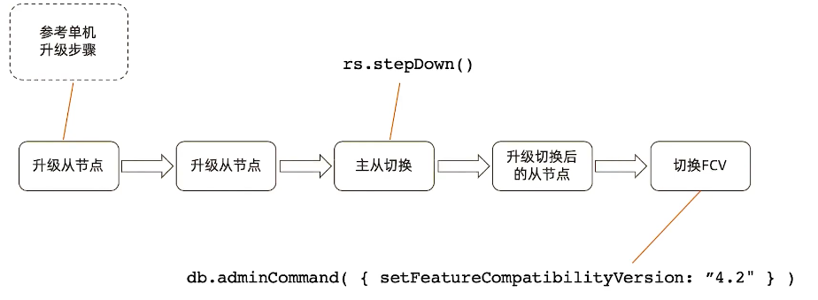
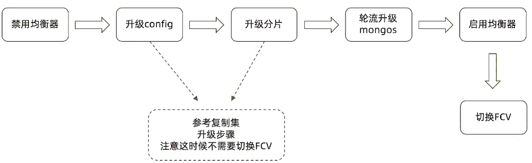

=================================
MongoDB上线及升级
=================================

上线前
===============
性能测试
-----------------

模拟真实压力， 对集群完成充分的性能测试，了解集群概况。

性能测试的输出：
    - 压测过程中各项指标表现，例如CRUD达到多少，连接数达到多少
    - 根据正常指标范围配置监控阈值
    - 根据压测结果按需调整硬件资源

环境检查
------------------

按照最佳时间要求对生产环境所使用的操作系统进行检查和调整。最常见的需要调整的参数包括：
    - 禁用NUMA， 否则在某些情况下会引起突发大量swap交换
    - 禁用Transparent Huge Page ， 否则会影响数据库效率
    - tcp_keepalive_time 调整为 120 秒， 避免一些网络问题
    - ulimit -n ， 避免打开文件句柄不足的情况
    - 关闭 atime， 提高数据文件访问效率

上线后
=================

性能监控
-------------

为防止突发状况， 应对常见性能指标进行监控以及及时发现问题

定期健康检查
---------------------

- mongod日志
- 环境是否有变动
- MongoDB配置是否有变动

主版本升级流程
=======================

单机升级流程
==================

复制集升级流程
======================

分片集群升级流程
======================

在线升级
===================

- MongoDB支持在线升级， 及升级过程中不需要间断服务
- 升级过程中虽然会发生主从节点切换， 存在段时间不可用， 但是：
    - 3.6版本开始支持自动写重试可以自动回复主从切换引起的集群暂时不可用
    - 4.2开始支持的自动读重试 则提供了 包括主从切换在内的读问题的自动恢复
- 升级需要逐版本完成， 不可用跳过版本
    - 正确： 3.2 > 3.4 > 3.6 > 4.0
    - 错误:  3.2 > 4.0
    - 原因：
        - MongoDB复制集仅仅允许相邻版本共存
        - 有一些升级内部数据格式 如 密码加密字段， 需要在升级过程中有mongo进行转化

降级
========================

如果升级无论因何种原因失败， 则需要降级到原有的旧版本。在降级过程中：
    - 滚动降级过程中集群可以保持在线， 仅在切换节点时会产生一定的不可写时间
    - 降级前应先去除已经用到的新版本特性。 例如用到了NumberDecimal则应把所有使用的文档先去除该字段
    - 通过设置FCV（Feature Compatibility Version） 可以在功能上降到与旧版本兼容
    - FCV设置完成后在滚动替换为旧版本