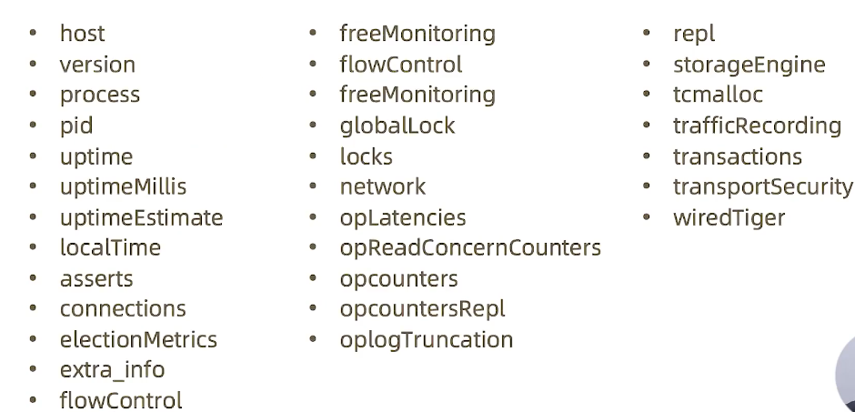
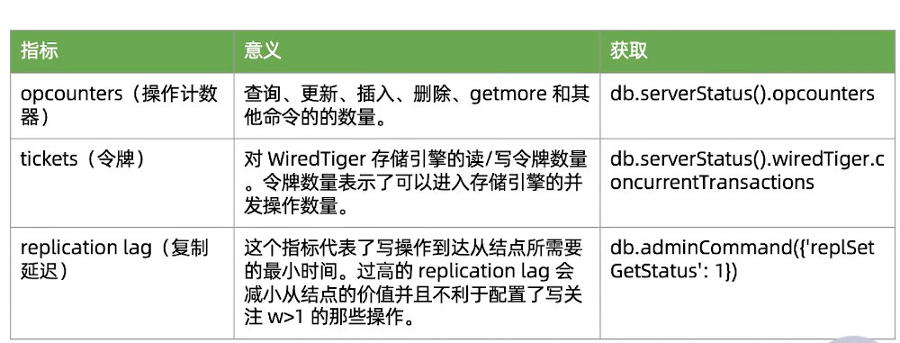
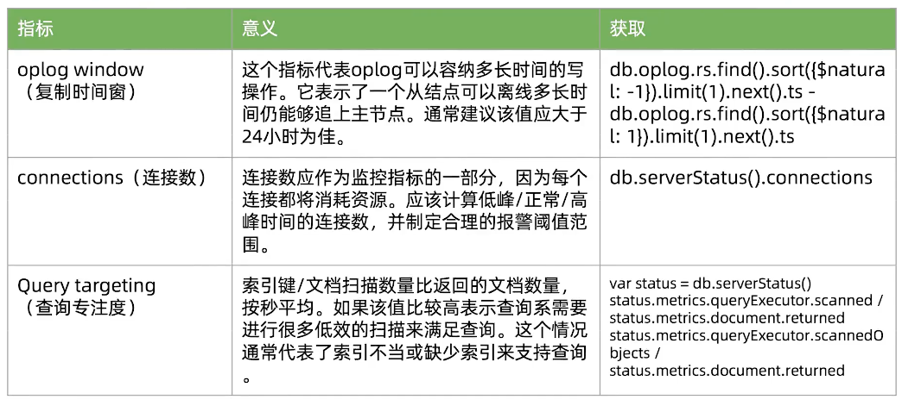
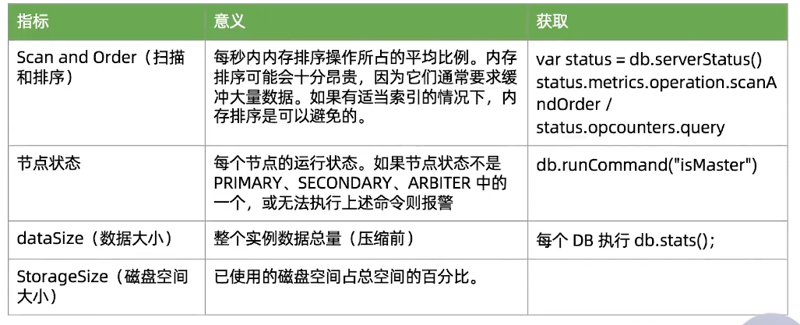

=======================
MongoDB监控
=======================

常用的监控工具及手段
=========================

- MongoDB Ops Manager
- Percona
- 通用监控平台
- 程序脚本

如何获取监控数据
======================

- 监控信息的来源
    - db.serverStatus()(主要)
    - db.isMaster()(次要)
    - mongostats 命令行工具 (只有部分信息)
- 注意： db.serverStatus() 包含的监控信息是从上次开机到现在为止的累计数据，因此不能简单使用

serverStatus() Output
===============================

serverStatus() 主要信息
===========================

- connections : 关于连接数的信息
- locks : 关于MongoDB使用的锁情况
- network : 网络使用情况
- opcounters : CRUD 的执行次数统计
- repl : 复制集配置信息
- wiredTiger : 包含大量WiredTiger执行情况信息：
    - block-manager : WT数据块的读写情况
    - session : session 使用情况
    - concurrentTransactions: Ticket 使用情况
- mem : 内存使用情况
- metrics : 一系列性能指标统计信息
- ..........

监控报警的考量
====================

- 具备一定的容错机制以减少报错的发送
- 总结应用的各指标峰值
- 适时调整报警阈值
- 留出足够的处理时间

建议监控指标
==================

