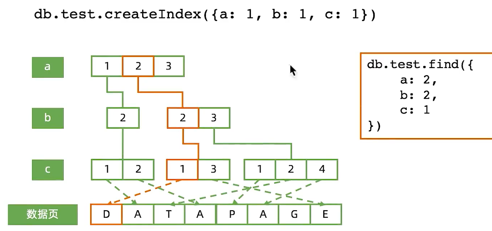

==========================
Mongodb索引机制
==========================

术语
=========================

Index/Key
-----------------------

Index / Key / DataPage  -----   索引 / 键 / 数据页？

Covered Query
-----------------------

Covered Query/FETCH  -----  查询覆盖/

IXSCAN/COLLSCAN
---------------------------

索引扫描/集合扫描

Big O Notation
-------------------------

时间复杂度

Query Shape
---------------------

查询的形状？

Index Prefix
----------------------

索引前缀

`db.human.createIndex({firstName:1,lastName:1,gender:1,age:1})`

以上索引的全部前缀包括：

- {firstName:1}
- {firstName:1, lastName:1}
- {firstName:1, lastName:1, gender:1}

*所有索引前缀都可以被改索引覆盖， 没有必要针对这些查询建立额外的索引*

Selectivity
----------------------

过滤性

在一个有10000条记录的集合中：

- 满足gender=F的记录有4000条
- 满足city = LA 的记录 有 100 条
- 满足 ln = 'Parker' 的记录有 10条

条件ln能过滤掉最多的数据， city其次， gander 最弱。 所以ln的过滤性(selectivity)大于city大于gender

| 如果要查询同时满足 `gender==F && city==SZ && ln=='parker'` 的记录
| 但只允许为gender/city/ln中的一个建立索引，因该把索引放在 ln

B树结构
======================

索引背后是B-树。 要正确使用索引， 必须先了解 B-树的 工作原理

B-树： 基于B树 ， 但是子节点数量可以超过2个

数据结构 与 算法复习
----------------------------

由于B数/B-树的工作过程过于复杂，但本质上它是一个有序的数据结构。我们用数组来理解他，假设索引为{a:1}(a升序):
::

    #数据                             #索引
    db.table.insert({a:1})              [*1*]
    db.table.insert({a:10})             [1, *10*]
    db.table.insert({a:5})              [1, *5*, 10]
    db.table.insert({a:7})              [1, 5 , *7* , 10]
    db.table.insert({a:3})              [1, *3*, 5, 7, 10]
    # 数据增加/删除始终保持被索引字段有序
    # 数据插入效率太低， 但B树可以高效实现
    # 在有序结构上实施二分查找， 可实现O(log2(n))高效查询

索引执行计划
======================

explain()
------------------

MongoDB索引类型
===========================

- 单键索引
- *组合索引*
- 多值索引
- *地理位置索引*
- *全文索引*
- TTL索引
- *部分索引*
- 哈希索引

组合索引
-----------------

`db.members.find({gender:'F', age:{$gte:18}}).sort({"join_date":1})`

组合索引工作模式
^^^^^^^^^^^^^^^^^^^

精确匹配
"""""""""""""""

范围查询
""""""""""""""

索引字段顺序的影响
^^^^^^^^^^^^^^^^^^^^^^^^^^

.. image:: ../../_static/mongodb/img/img_128.png
    :align:  center

地理位置索引
---------------------

.. image:: ../../_static/mongodb/img/img_130.png
    :align:  center

全文索引
-----------------------

部分索引
-------------------

其他所以技巧
====================

后台创建索引：`db.member.createIndex({city:1},{background:true})`

对BI/ 报表专用节点单独创建索引：

- 该从节点priority设为0
- 关闭该节点
- 以单机模式启动
- 添加索引（分析用）
- 关闭该节点， 以副本集模式启动