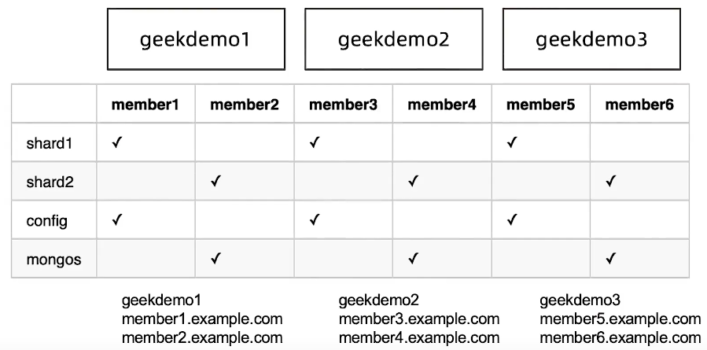

=======================
分片集群搭建及扩容
=======================

目标及流程
=================

- 目标： 学习如何搭建一个2分片的分片集群
- 环境： 3 台 Linux 虚拟机， 4Core 8 GB
- 步骤：
    - 配置域名解析
    - 准备分片目录
    - 创建一个分片复制集并初始化
    - 创建config 复制集并初始化
    - 初始化分片集群， 加入第一个分片
    - 创建分片表
    - 加入第二个分片

实验架构
======================

.. image:: ../../_static/mongodb/img/img_94.png
    :align: center

1 配置域名解析
=====================

在3台虚拟机上分别执行以下3条命令， 主要替换实际IP地址:
::

    echo '192.168.1.1 geekdemo1 menber1.example.com member2.example.com' >> /etc/host
    echo '192.168.1.2 geekdemo2 menber3.example.com member4.example.com' >> /etc/host
    echo '192.168.1.3 geekdemo3 menber5.example.com member6.example.com' >> /etc/host

2 准备分片目录
=====================

在各服务器上创建数据目录， 我们使用 '/data'， 请按自己需要修改的其他目录：

- 在member1/member3/member5 上执行 以下命令：
::

    mkdir -p /data/shard1/
    mkdir -p /data/config/

- 在member2/member4/member6 上执行以下命令：
::

    mkdir -p /data/shard2/
    mkdir -p /data/mongos/

3 创建第一个分片用的复制集
==============================

在member1/member3/member5 上执行以下命令：
::

    mongod --bind_ip 0.0.0.0 --replSet shard1 --dbpath /data/shard1 --logpath /data/shard1/mongod.log --port 27010 --fork --shardsvr --wiredTigerCacheSizeGB 1

4 初始化第一个分片复制集
================================

::

    mongo --host member1.example.com:27010
    re.initiate({
        _id:"shard1",
        "members":[
            {"_id":0, "host":"member1.example.com:27010"},
            {"_id":1, "host":"member3.example.com:27010"},
            {"_id":2, "host":"member5.example.com:27010"}
        ]
    })
    { "ok" : 1 }

5 创建 config server 复制集
===================================

在member1/member3/member5 上执行以下命令：
::

    mongod --bind_id 0.0.0.0 --replSet config --dbpath /data/config --logpath /data/config/mongod.log --port 27019 --fork --configsvr --wiredTigerCacheSizeGB 1

6 初始化 config server 复制集
======================================

::

    mongo --host member1.example.com:27019
    re.initiate({
        _id:"config",
        "members":[
            {"_id":0, "host":"member1.example.com:27019"},
            {"_id":1, "host":"member3.example.com:27019"},
            {"_id":2, "host":"member5.example.com:27019"}
        ]
    })

    {
        "ok" : 1,
        "$gleStats" : {
                "lastOpTime" : Timestamp(1650523162, 1),
                "electionId" : ObjectId("000000000000000000000000")
        },
        "lastCommittedOpTime" : Timestamp(1650523162, 1)
    }

7 在第一台机器上搭建mongos
=================================

::

    # 启动mongos服务
    mongos --bind_id 0.0.0.0 --logpath /data/mongos/mongos.log --port 27017 --fork --configdb config/member1.example.com:27019,member3.example.com:27019,member5.example.com:27019
    # 连接到mongos
    mongo --host member1.example.com:27017
    mongos> sh.addShard("shard1/member1.example.com:27010,member3.example.com:27010,member5.example.com:27010")
    {
        "shardAdded" : "shard1",
        "ok" : 1,
        "$clusterTime" : {
                "clusterTime" : Timestamp(1650524253, 7),
                "signature" : {
                        "hash" : BinData(0,"AAAAAAAAAAAAAAAAAAAAAAAAAAA="),
                        "keyId" : NumberLong(0)
                }
        },
        "operationTime" : Timestamp(1650524253, 7)
    }
8 创建分片表
===================

::

    #连接到mongos， 创建分片集合
    mongo --host member1.example.com:27017

    mongos> sh.status()

    --- Sharding Status ---
      sharding version: {
            "_id" : 1,
            "minCompatibleVersion" : 5,
            "currentVersion" : 6,
            "clusterId" : ObjectId("6260fc241b454ae0793b2a1c")
      }
      shards:
            {  "_id" : "shard1",  "host" : "shard1/member1.example.com:27010,member2.example.com:27011,member3.example.com:27012",  "state" : 1,  "topologyTime" : Timestamp(1650524253, 4) }
      active mongoses:
            "5.0.6" : 1
      autosplit:
            Currently enabled: yes
      balancer:
            Currently enabled: yes
            Currently running: no
            Failed balancer rounds in last 5 attempts: 0
            Migration results for the last 24 hours:
                    No recent migrations
      databases:
            {  "_id" : "config",  "primary" : "config",  "partitioned" : true }

    mongos> sh.enableSharding('foo')

    mongos> sh.shardCollection('foo.bar', {_id:'hashed'})
    mongos> sh.status()

    # 相比上次 status() 多出来的块信息
    {  "_id" : "foo",  "primary" : "shard1",  "partitioned" : true,  "version" : {  "uuid" : UUID("96fbff23-b771-4146-8fec-fe49640bb7c8"),  "timestamp" : Timestamp(1650524455, 1),  "lastMod" : 1 } }
    foo.bar
            shard key: { "_id" : "hashed" }
            unique: false
            balancing: true
            chunks:
                    shard1  2
            { "_id" : { "$minKey" : 1 } } -->> { "_id" : NumberLong(0) } on : shard1 Timestamp(1, 0)
            { "_id" : NumberLong(0) } -->> { "_id" : { "$maxKey" : 1 } } on : shard1 Timestamp(1, 1)

    # 插入测试数据
    use foo
    for ( var i = 0; i <10000; i++){
        db.bar.insert({i:i});
    }

9 创建第2个分片的复制集
========================

在member2/member4/member6 上执行以下命令：
::

    mongod --bind_id 0.0.0.0 --replSet Shard2 --dbpath /data/shard2 --logpath /data/shard2/mongod.log --port 27011 --fork --shardsvr --wiredTigerCacheSizeGB 1

10 初始化第二个分片的复制集
=================================

::

    # mongo --host member2.example.com:27011

    rs.initiate({
        _id:"shard2",
        "members":[
            {"_id": 0, "host": "member2.example.com:27011"}
            {"_id": 1, "host": "member4.example.com:27011"}
            {"_id": 2, "host": "member6.example.com:27011"}
        ]
    })

11 加入第2个分片
=====================

::

    # 连接到mongos ， 添加分片
    mongo --host member1.example.com:27017

    mongos> sh.addShard("shard2/member2.example.com:27011,member4.example.com:27011,member6.example.com:27011")

    {
        "shardAdded" : "shard2",
        "ok" : 1,
        "$clusterTime" : {
                "clusterTime" : Timestamp(1650526483, 3),
                "signature" : {
                        "hash" : BinData(0,"AAAAAAAAAAAAAAAAAAAAAAAAAAA="),
                        "keyId" : NumberLong(0)
                }
        },
        "operationTime" : Timestamp(1650526483, 3)
    }

    mongos> sh.status()
    # 与只有一个分片时的 块分配发生了变化
    foo.bar
        shard key: { "_id" : "hashed" }
        unique: false
        balancing: true
        chunks:
                shard1  1   # 原来是 shard1 2 两个块都在 shard1上
                shard2  1   # 现在 两个分片 分别有一个块
        { "_id" : { "$minKey" : 1 } } -->> { "_id" : NumberLong(0) } on : shard2 Timestamp(2, 0)
        { "_id" : NumberLong(0) } -->> { "_id" : { "$maxKey" : 1 } } on : shard1 Timestamp(2, 1)

