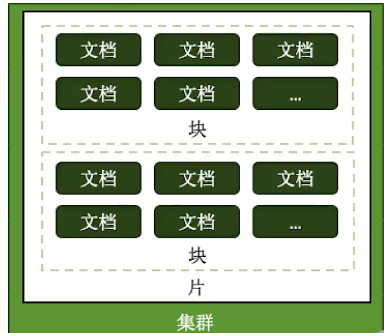

====================
分片集群设计
====================

如何用好分片集群
=======================

- 合理的架构
    - 是否需要分片 ？
    - 需要多少分片？
    - 数据的分布规则
- 正确的姿势
    - 选择需要的分片表
    - 选择正确的片键
    - 使用合适的均衡策略
- 足够的资源
    - CPU
    - RAM
    - 存储

合理的架构
====================

分片大小
--------------

分片的基本标准：

- 关于数据： 数据量不超过 3TB ， 尽仅能保持在2TB 一个片
- 关于索引： 常用索引必须容纳进内存

按照以上标准初步确定分片后， 还需要考虑业务压力， 随着压力增大， CPU， PAM ， 磁盘中的如何一项出现瓶颈时， 都可以通过添加更多的分片来解决。

需要多少个分片
------------------

::

    A = 所需存储总量 / 单服务器可挂载容量  8TB / 2TB = 4
    B = 工作集大小 / 单服务器内存容量  400GB / (256GB * 0.6) = 3
    C = 并发量总数 / （单服务器并发量 * 0.7）  30000 / (9000 * 0.7) = 6  # 额外开销
    分片数量 = max(A, B ,C)

其他需求
---------------

考虑分片的分布：

- 是否需要跨机房分布分片
- 是否需要容灾
- 高可用的要求如何

正确的姿势
=================

各种概念有小到大：

- 片键 shard key : 文档中的一个字段
- 文档 doc ： 包含shard key 的一行数据
- 块 Chunk ： 包含n个文档
- 分片 Shard ： 包含 n 个chunk
- 集群 Cluster ： 包含n个分片

选择合适片键
-------------------

影响片键效率的主要因素：

- 取值基数（Cardinality）
- 取值分布
- 分散写， 集中读
- 被尽可能多的业务场景用到
- 避免单调递增或递减的片键

选择基数大的片键
^^^^^^^^^^^^^^^^^^^^^

对于小基数的片键：

- 因为备选值有限， 那么块的总数量就有限；
- 随着数据增多， 块的大小会越来越大
- *太大的块， 会导致水平扩展时移动块会非常困难*

例如 ： 存储一个高中的师生数据， 以年龄（假设年龄范围为 15 ~ 65岁）作为片键，那么：

- 15 <= 年龄 <= 65 ，且 只为整数
- 最多只会有 51 个chunk
- 大部分的年龄范围 为 15 ~ 18 岁（学生）
- 15、16、17、18四个chunk的数据量， 访问压力远远大于其他chunk

结论： `取值基数要大！` ， `取值分布应尽可能均匀`

定向性好
------------------

考虑：

- 4个分片的集群， 你希望读某条特定的数据
- 如果你用片键作为条件查询， mongos 可以直接定位到具体的分片
- 如果你不用片键， mongos 需要吧查询发到4个分片
- 等最后一个分片响应，mongos才能响应应用端

结论： `对主要查询要具有定向的能力`

足够的资源
===============

mongos 与 config 通常小号很少的资源， 可以选择低规格的虚拟机；

资源的重点在于 shard 服务器：

- 需要足以容纳热数据索引的内存
- 正确创建索引后CPU通常不会成为瓶颈， 除非涉及非常多的计算
- 磁盘尽量选择SSD

最后， 实际测试是最好的检验， 来看你的资源配置是否完备

| 即使在初期已经具备了足够的资源， 仍然需要考虑在合适的时候拓展。
| 建议监控各项资源的使用情况，无论哪一项达到60%以上， 则开始考虑扩容，因为：

- 扩展需要新的资源， 申请新资源需要时间
- 扩展后数据需要均衡， 均衡需要时间。 应保证新数据入库速度慢于均衡速度
- 均衡需要资源， 如果资源即将或已经耗尽， 均衡也是会很低效的

一个Email系统的片键例子
==============================

::

    {
        _id:ObjectId(),
        user: 123,
        time: Date(),
        subject: "...",
        recipients: [],
        body: "...",
        attachments: []
    }

片键 ： {_id:1}
--------------------

片键 ： {_id: "hashed"}
---------------------------------

片键 ： {user_id: 1}
---------------------------------

片键 ： {user_id: 1, time: 1}
---------------------------------

