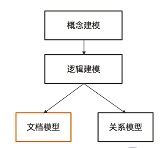
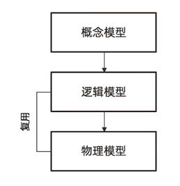
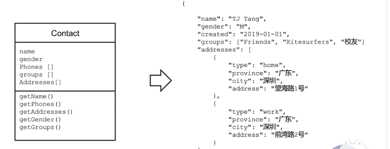

MongoDB文档模型设计的三个误区
=============================

1. 不需要模型设计
2. MongoDB 因该用一个超级大的文档来组织所有数据
#. MongoDB 不支持关联或事务

*以上三点都是不正确的*

关于Json文档模型设计
=======================

| 文档模型设计处于是物理模型设计阶段（PDM）
| Json文档模型通过模型内嵌数组或引用字段来表示关系
| 文档模型设计 不遵循 第三范式， 允许冗余

为什么说MongoDB是无模式
=========================

| 严格来说MongoDB同样需要 概念/逻辑建模
| 文档模型设计的物理结构可以和逻辑层相似

MongoDB无模型的由来:
 | 可以省略物理建模的具体过程

逻辑模型 - Json模型
=======================

文档模型的设计原则：性能和易用
=================================

关系模型 VS 文档模型
========================

