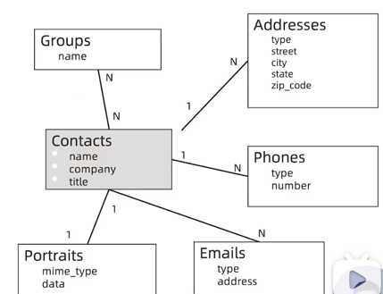
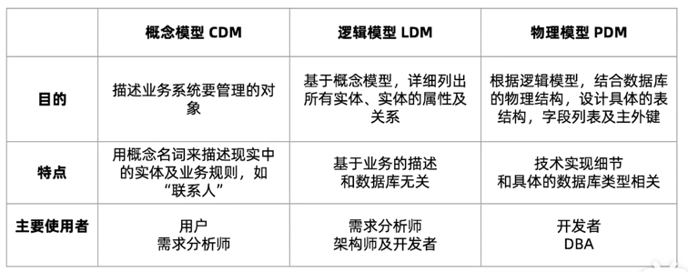
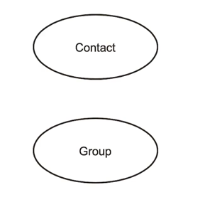
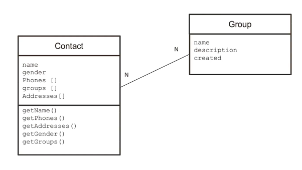
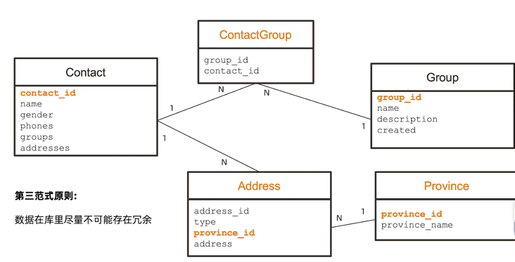

===============
数据模型
===============

什么是数据模型
===============

数据模式是由一组由符号，文本组成的集合， 用以准确的表达信息，达到有效交流、沟通的目的。

数据模型设计的元素
====================

实体 Entity
--------------

- 描述业务的主要数据集合
- 谁，什么， 何时， 何地， 如何

属性  Attribute
--------------------

- 描述实体里面的单个信息

关系  Relationship
------------------------

- 描述实体与实体之间的数据规则
- 结构规则： 1-1， 1-N， N-N

传统模型设计：从概念到逻辑到物理
===================================

从开发者的角度：概念模型
---------------------------

从开发者的角度：逻辑模型
---------------------------

从开发者的角度：物理模型
---------------------------

模型设计总结
================

- 数据模型三要素：
    - 实体
    - 属性
    - 关系
- 数据模型三层深度：
    - 概念， 逻辑， 物理
    - 一个模型逐步细化的过程

