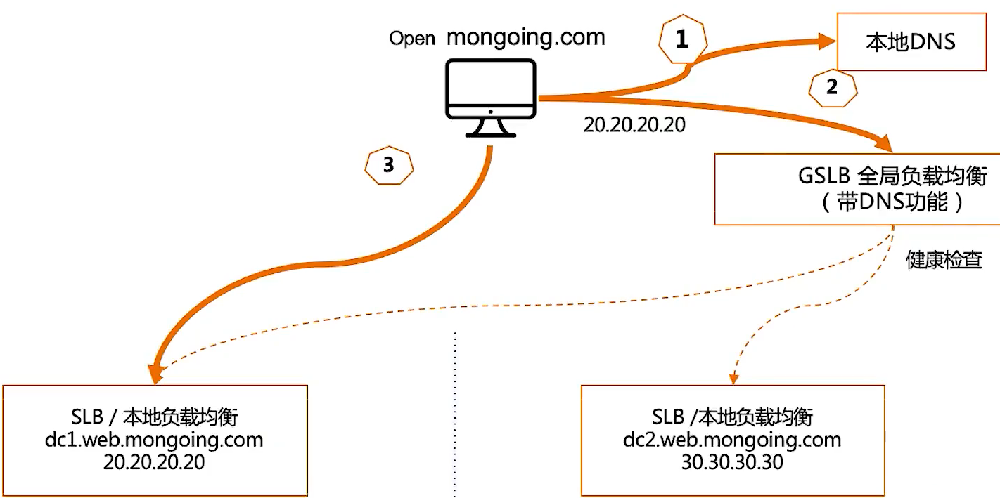
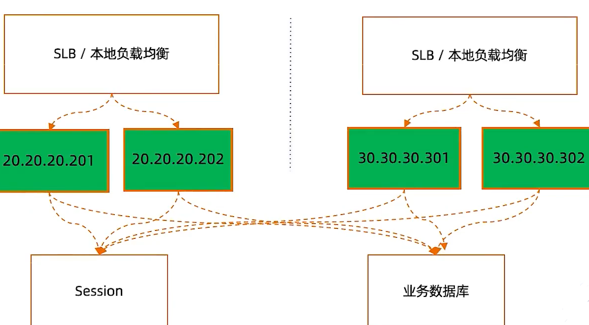
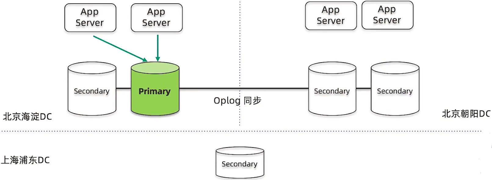
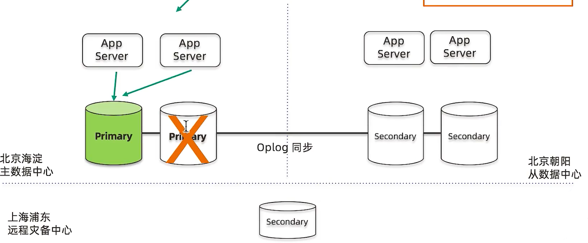
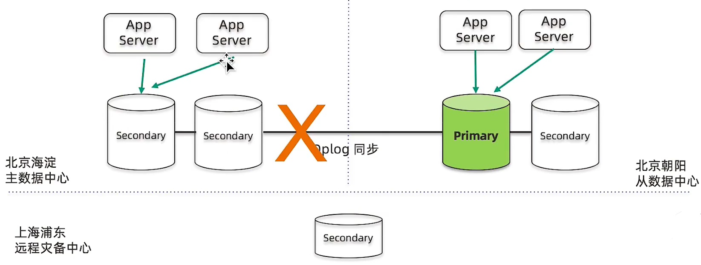
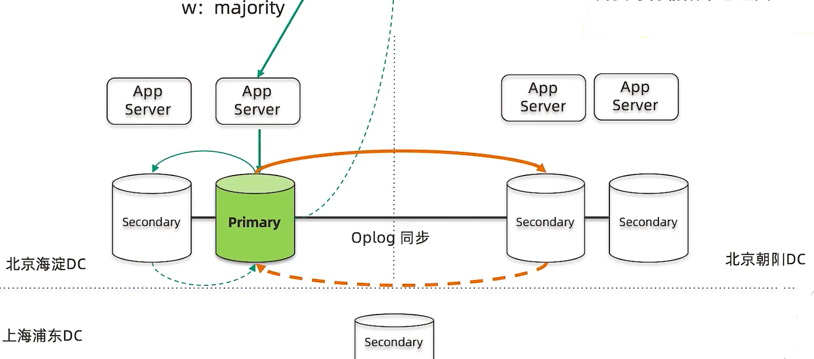

============================
集群设计：两地三中心
============================

容灾级别
=================

.. image:: ../_static/mongodb/img/img_145.png
    :align: center

双活的技术组件
====================

网络层解决方案
-----------------

应用层解决方案
--------------------

- 使用负载均衡， 虚拟IP
- 使用同一个Session
- 使用同一套数据

数据库解决方案
-----------------------

数据跨中心同步

MongoDB三中心方案
=======================

复制集跨中心部署
---------------------

*正常运行状态集群内一个主节点接受写， 其他节点只读*

*主节点故障， 主数据中心内自动切主， 切换时间5-10秒*

*主数据中心对外网络故障 或整个数据中心不可用 主节点自动降级， 从节点升级为主节点， 选举时间为 5- 30秒*

*双中心双活，分流模式  从节点需要跨中心写到主节点 同城双中心 需要低延迟专线*

*正常运行  writeConcern:majority 需要等待从节点返回*

MongoDB集群两地三中心不是的考量点
====================================

- 节点数量建议要5个， 2+2+1模式
- 主数据中心的两个节点要设置高一些的优先级， 减少跨中心换主节点
- 同城双中心之间的网络要保证低延迟和频宽， 满足 `writeConcern:majority` 的双中心写需求
- 使用`Retryable Writes and Retryable Reads`来保证零下线时间
- 用户需要自行处理好业务层的双中心切换

示例
==================

- 目标 ： 三中心部署的MongoDB复制集
- 环境 ： 5台服务器（2+2+1）
- 这里将模拟 5 台服务器   启动不同的5个mongod服务
- member1.example.com member2.example.com 为主数据中心
- member3.example.com member4.example.com 为从数据中心
- member5.example.com 为备份中心

1 配置域名解析
------------------------

通过 vim /etc/hosts 直接在最后加上:
::

    47.106.86.25 member1.example.com member2.example.com member3.example.com member4.example.com member5.example.com

通过管道符添加:
::

    echo '47.106.86.25 member1.example.com member2.example.com member3.example.com member4.example.com member5.example.com' >> /etc/hosts

2 启动mongod服务
-----------------------------

通过命令行启动：
::

    mongod --replSet demo --bind_ip 0.0.0.0 --dbpath /data/db1 --logpath /data/db1/mongod.log --fork --port 27011
    mongod --replSet demo --bind_ip 0.0.0.0 --dbpath /data/db2 --logpath /data/db2/mongod.log --fork --port 27012
    mongod --replSet demo --bind_ip 0.0.0.0 --dbpath /data/db3 --logpath /data/db3/mongod.log --fork --port 27013
    mongod --replSet demo --bind_ip 0.0.0.0 --dbpath /data/db4 --logpath /data/db4/mongod.log --fork --port 27014
    mongod --replSet demo --bind_ip 0.0.0.0 --dbpath /data/db5 --logpath /data/db5/mongod.log --fork --port 27015

通过conf配置文件启动:
::

    pass

3 配置复制集
--------------------------

::

    mongo -port 10000  # 进入mongodb客户端
    > rs.initiate({
        _id:"demo",
        members:[
            {_id:0,host:"member1.example.com:27011"},
            {_id:1,host:"member2.example.com:27012"},
            {_id:2,host:"member3.example.com:27013"},
            {_id:3,host:"member4.example.com:27014"},
            {_id:4,host:"member5.example.com:27015"},
        ]
    }) # 初始化 并 添加节点

4 配置优先级
--------------------------

::

    demo:PRIMARY> conf = rs.config()
    demo:PRIMARY> conf.members[1].priority = 10
    10
    demo:PRIMARY> conf.members[2].priority = 5
    5
    demo:PRIMARY> rs.reconfig(conf)
    {
            "ok" : 1,
            "$clusterTime" : {
                    "clusterTime" : Timestamp(1650889809, 1),
                    "signature" : {
                            "hash" : BinData(0,"AAAAAAAAAAAAAAAAAAAAAAAAAAA="),
                            "keyId" : NumberLong(0)
                    }
            },
            "operationTime" : Timestamp(1650889809, 1)
    }
    # 通常都有主备数据中心之分， 我们希望给主数据中心更高的优先级

5 启动持续写脚本
--------------------------

::

    # 连接 mongo
    mongo --retryWrites mongodb://member1.example.com:27011,member2.example.com:27012,member3.example.com:27013,member4.example.com:27014,member5.example.com:27015/test?replicaSet=demo
    # 复制集连接方式

    # cat ingest-script
    for(var i = 1; i<1000; i++){
        db.test.insert({i:i});
        inserted = db.test.findOne({i:i});
        print(inserted);
        sleep(500);
    }

    # 执行脚本
    mongo --retryWrites mongodb://member1.example.com:27011,member2.example.com:27012,member3.example.com:27013,member4.example.com:27014,member5.example.com:27015/test?replicaSet=demo ingest-script

6 模拟从数据中心故障
--------------------------

::

    [root@sanye ~]# ps -ef |grep mongod
    root     21642     1  0 20:22 ?        00:00:11 mongod --replSet demo --bind_ip 0.0.0.0 --dbpath /data/db1 --logpath /data/db1/mongod.log --fork --port 27011
    root     21811     1  0 20:23 ?        00:00:10 mongod --replSet demo --bind_ip 0.0.0.0 --dbpath /data/db3 --logpath /data/db3/mongod.log --fork --port 27013
    root     21874     1  0 20:24 ?        00:00:10 mongod --replSet demo --bind_ip 0.0.0.0 --dbpath /data/db4 --logpath /data/db4/mongod.log --fork --port 27014
    root     21954     1  0 20:24 ?        00:00:10 mongod --replSet demo --bind_ip 0.0.0.0 --dbpath /data/db5 --logpath /data/db5/mongod.log --fork --port 27015
    root     22971     1  0 20:34 ?        00:00:06 mongod --replSet demo --bind_ip 0.0.0.0 --dbpath /data/db2 --logpath /data/db2/mongod.log --fork --port 27012
    root     24104 23857  1 20:48 pts/1    00:00:00 mongo --retryWrites mongodb://member1.example.com:27011,member2.example.com:27012,member3.example.com:27013,member4.example.com:27014,member5.example.com:27015/test                 ingest-script
    root     24137 21384  0 20:49 pts/0    00:00:00 grep --color=auto mongod
    [root@sanye ~]# kill -9 21811 21874
    # 27013 27014 为从数据中心
    # 从数据挂掉后 正常写入 无任何影响

7 模拟主数据中心故障
--------------------------

::

    [root@sanye ~]# ps -ef|grep mongod
    root     21642     1  0 20:22 ?        00:00:12 mongod --replSet demo --bind_ip 0.0.0.0 --dbpath /data/db1 --logpath /data/db1/mongod.log --fork --port 27011
    root     21954     1  0 20:24 ?        00:00:12 mongod --replSet demo --bind_ip 0.0.0.0 --dbpath /data/db5 --logpath /data/db5/mongod.log --fork --port 27015
    root     22971     1  0 20:34 ?        00:00:08 mongod --replSet demo --bind_ip 0.0.0.0 --dbpath /data/db2 --logpath /data/db2/mongod.log --fork --port 27012
    root     24104 23857  0 20:48 pts/1    00:00:00 mongo --retryWrites mongodb://member1.example.com:27011,member2.example.com:27012,member3.example.com:27013,member4.example.com:27014,member5.example.com:27015/test                 ingest-script
    root     24244     1  7 20:51 ?        00:00:01 mongod --replSet demo --bind_ip 0.0.0.0 --dbpath /data/db3 --logpath /data/db3/mongod.log --fork --port 27013
    root     24349     1 12 20:51 ?        00:00:01 mongod --replSet demo --bind_ip 0.0.0.0 --dbpath /data/db4 --logpath /data/db4/mongod.log --fork --port 27014
    root     24455 21384  0 20:51 pts/0    00:00:00 grep --color=auto mongod
    [root@sanye ~]# kill -9 21642 22971
    # 27011 27012 为主数据中心
    [root@sanye ~]# ps -ef|grep mongod
    root     21954     1  0 20:24 ?        00:00:12 mongod --replSet demo --bind_ip 0.0.0.0 --dbpath /data/db5 --logpath /data/db5/mongod.log --fork --port 27015
    root     24104 23857  0 20:48 pts/1    00:00:00 mongo --retryWrites mongodb://member1.example.com:27011,member2.example.com:27012,member3.example.com:27013,member4.example.com:27014,member5.example.com:27015/test                 ingest-script
    root     24244     1  3 20:51 ?        00:00:01 mongod --replSet demo --bind_ip 0.0.0.0 --dbpath /data/db3 --logpath /data/db3/mongod.log --fork --port 27013
    root     24349     1  4 20:51 ?        00:00:01 mongod --replSet demo --bind_ip 0.0.0.0 --dbpath /data/db4 --logpath /data/db4/mongod.log --fork --port 27014
    root     24518 21384  0 20:51 pts/0    00:00:00 grep --color=auto mongod
    # 主数据中心 挂掉后  持续写入脚本 会暂停几秒钟
    # 这几秒 时间  从节点 和 备份节点 在选择 新的主节点